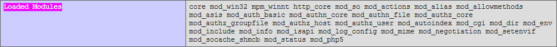
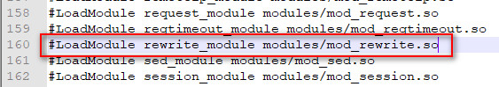
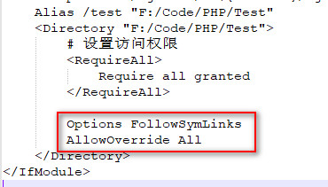
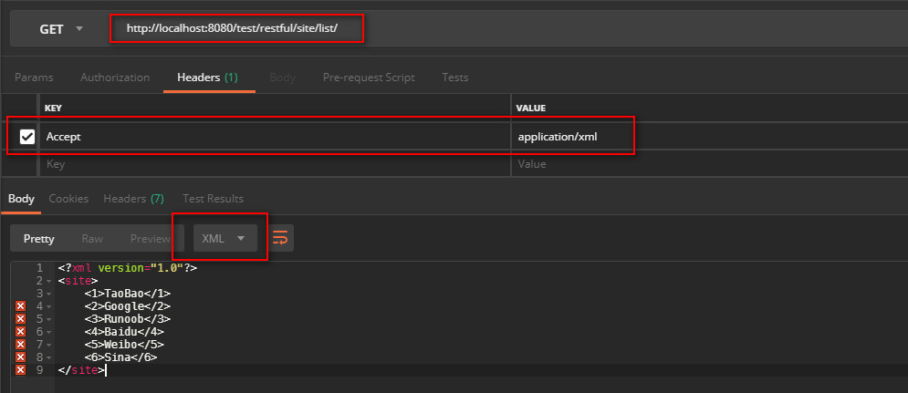
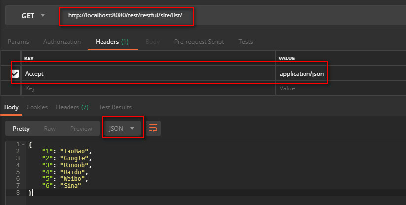

## RESTful
> xxx

## 环境配置

通过phpinfo检查`Loaded Modules`配置中是否包含`mod_rewrite`模块。



这里没有，所以要修改Apache中的`httpd.conf`配置文件。
找到`LoadModule rewrite_module`，然后除掉前面的`#`号即可。



修改对`.htaccess`文件的支持



重启Apache.

**注：这里的Domain为`http://localhost:8080/test`**

## RESTful in PHP

### HTTP Test 工具
> Postman

### TEST1
编写如下php代码以显示phpinfo
*php-info.php*

```php
<?php
echo phpinfo();
```

在 RESTful 之前要访问此 php-info.php 的URL是这样的：
```
http://localhost:8080/test/php-info.php
```

而如果我们像这样修改`.htaccess`文件
```
# 开启 rewrite 功能
Options +FollowSymlinks
RewriteEngine on
# 重写规则
RewriteRule ^php-info   php-info.php
```

就可以像这样来访问
```
http://localhost:8080/test/php-info
```

#### TEST2






[github](https://github.com/blog-demos/simple-restful-php)
