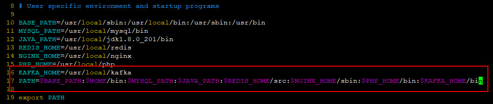
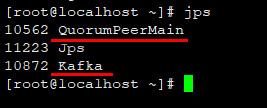
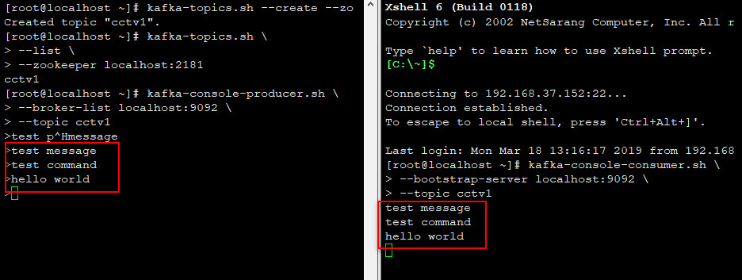

## Kafka on Centos7.6

### 0.SYSTEM

| Serial | Environment | Version                              |
|:------:|:-----------:|:-------------------------------------|
| 1      | ISO         | CentOS-7-x86_64-DVD-1810.iso         |
| 2      | Linux       | CentOS Linux release 7.6.1810 (Core) |
| 3      | Kafka       | 2.11-2.1.1                           |

### 1.INSTALL

```shell
wget https://mirrors.tuna.tsinghua.edu.cn/apache/kafka/2.1.1/kafka_2.11-2.1.1.tgz
tar -zxvf kafka_2.11-2.1.1.tgz
cd kafka_2.11-2.1.1
```

```shell
mv /root/downloads/kafka_2.11-2.1.1 /usr/local/kafka
```

```shell
cd /usr/local/kafka/config
cat zookeeper.properties | grep -v '#' >> zk.properties
```

```shell
vim zk.properties
```


### 2.SYSTEM ENVIRONMENT VARIABLE

```shell
vim ~/.bash_profile
```



```shell
source ~/.bash_profile
```

### 3.FIREWALL

```shell
firewall-cmd --zone=public --add-port=2181/tcp --permanent
firewall-cmd --reload
firewall-cmd --zone=public --list-ports
```


### 4.START-UP zookeeper

```shell
zookeeper-server-start.sh /usr/local/kafka/config/zk.properties
```

```shell
jps
```
```
8156 Jps
7806 QuorumPeerMain
```

### 5.START-UP broker (kafka)
```shell
cd /usr/local/kafka/config/
cat server.properties | grep -v '#' >> kafka1.properties
kafka-server-start.sh /usr/local/kafka/config/kafka1.properties
```

```shell
jps
```



### 6.CREATE TOPIC

```shell
kafka-topics.sh \
--create \
--zookeeper localhost:2181 \
--replication-factor 1 \
--partitions 1 \
--topic cctv1
```

check by this shell
```shell
kafka-topics.sh \
--list \
--zookeeper localhost:2181
```

### 7.PUBLISH MESSAGE

```shell
kafka-console-producer.sh \
--broker-list localhost:9092 \
--topic cctv1
```

### 8.CONSUME MESSAGE

```shell
kafka-console-consumer.sh \
--bootstrap-server localhost:9092 \
--topic cctv1
```



### Ref
- https://blog.csdn.net/gscsd_t/article/details/80089269
