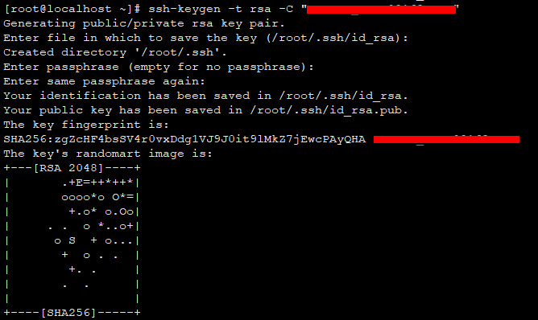

## Git on Centos7.6
> Simple git client base on github.

### 0.SYSTEM

| Serial | Environment | Version                              |
|:------:|:-----------:|:-------------------------------------|
| 1      | ISO         | CentOS-7-x86_64-DVD-1810.iso         |
| 2      | Linux       | CentOS Linux release 7.6.1810 (Core) |
| 3      | Git         | git version 1.8.3.1                  |

### 1.INSTALL

```shell
yum –y install git
```
```shell
mkdir /usr/local/git;cd /usr/local/git
```

### 2.CLIENT

#### 2.1.CONFIG GIT USER
```shell
git config --global user.name "[your-name]"
git config --global user.email "[your-email]"
```

#### 2.2.SSH-KEYGEN
```shell
ssh-keygen -t rsa -C "[your-email]"
```



#### 2.3.COPY id_rsa.pub TO GITHUB
> 略

#### 2.4 GIT TEST
```shell
git clone xxx
git add .
git commit -m "xxx"
git pull
git push
```

### Ref
- https://www.cnblogs.com/liter7/p/6581344.html
