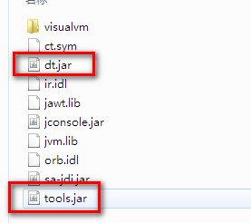

### JAVA_HOME
```
D:\soft\study\jdk1.7.0_01
```
JAVA_HOME里配置的是我们jdk安装的路径，这样配置就好。如果你是要用到JAVA_HOME的话，那就不要在JAVA_HOME的后面再添加分号(;)，这样反而出问题。如下：


### Path
```
.;%JAVA_HOME%\bin;
```
此处的这个路径用到了上面的JAVA_HOME。有几点需要注意：<br/>
1.路径前面要有一个点号(.)，用来指定当前文件夹；<br/>
2.此路径要添加在系统原本的路径（%SystemRoot%\system32;%SystemRoot%;..............）前面；<br/>
3.此路径和系统原本路径之间要有一个分号(;)隔开。
如下：


### CLASSPATH
```
.;%JAVA_HOME%\lib\dt.jar;%JAVA_HOME%\lib\toos.jar;
```
CLASSPATH这里没有什么要注意的，唯一的可能就是去查检一下上面的路径中的文件是否都存在。如下：



