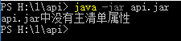
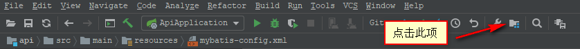
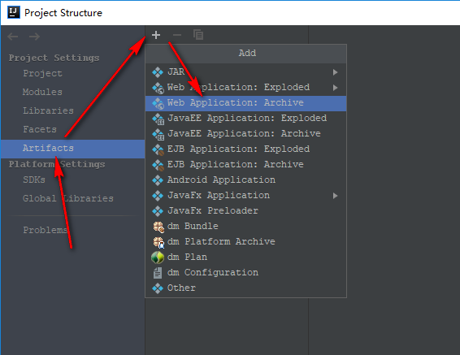
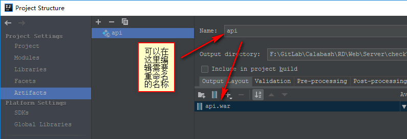
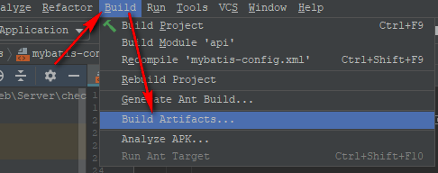
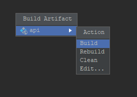

## Java程序的部署

### Jar

#### 可执行jar

#### 运行
> java -jar xxx.jar

#### 不可执行jar
> 待定

### 可执行War

1.点击【File】->【Project Structure】菜单（或使用Shift+Ctrl+Alt+S快捷键），打开【Project Structure】窗口

2.在【ProjectStructure】中选择左侧的【Artifacts】页签。点击中间上面的，选择【WebApplication:Archive】

这里可以将`unnamed`重命名（本示例中，我重命名为：`api`）。

3.xxx

### Jar vs War

> xxx

### 基于命令行的打包方式

> xxx

### Ref
-
