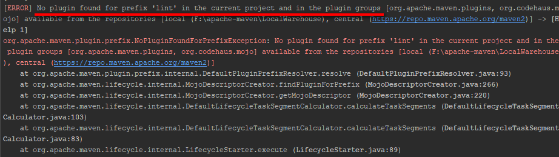
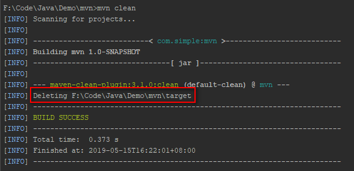

## Maven常用命令合集

> Maven库：<br>
> [http://repo2.maven.org/maven2/](http://repo2.maven.org/maven2/)
>
> Maven依赖查询：<br>
> http://mvnrepository.com/

### Commands

#### 1.编译源码

```shell
mvn compile
```
这个命令是编译源码，完成后会在项目根目录下生成`target`目录。<br>


如果项目中编写了`unchecked`的代码，会报这样的错误信息：
```
...某些输入文件使用了未经检查或不安全的操作
```
这里只要在命令中添加参数：`-Xlint:unchecked`即可，就像下面这样
```shell
mvn compile -Xlint:unchecked
```

通过`-Xlint:unchecked`可能会报如下错误：<br>


这是在第一次使用`-Xlint:unchecked`时出现的，可以先`update`一下

#### 2.编译测试代码

```shell
mvn test-compile
```

运行上述命令后，`target`目录中会多出这两个子目录。如下：


#### 3.运行测试

```shell
mvn test
```
如果测试全部通过会出现如下结果：<br>


以下是测试不通过的结果展示：<br>


#### 4.产生site

```shell
mvn site
```

完成后生成如下目录：<br>


如果你的项目没有成功生成，可以检查一下`maven`的配置
```xml
<plugin>
    <artifactId>maven-site-plugin</artifactId>
    <version>3.7.1</version>
</plugin>
```

#### 5.打包

##### 5.1.直接打包

```shell
mvn package
```

通过打包日志，可以看到已经打包完成<br>
<br>
检查项目发现的确已经生成<br>


##### 5.2.跳过单元测试

通过`mvn package`打包后，会运行单元测试，只有单元测试通过才会打包成功；如果单元测试中存在未测试通过的单元测试，则会出现如下报错：<br>


这时可以通过在`pom.xml`中配置`maven`来解决，如下：
```xml
<plugins>
	<plugin>
		<groupId>org.apache.maven.plugins</groupId>
		<artifactId>maven-surefire-plugin</artifactId>
		<version>2.4.2</version>
		<configuration>
			<skipTests>true</skipTests> <!-- true表示跳过单元测试 -->
		</configuration>
	</plugin>
</plugins>
```


#### 6.在本地Repository中安装jar

```shell
mvn install
```

#### 7.清除产生的项目

```shell
mvn clean
```

通过`clean`日志可以看到`clean`命令主要是删除`target`目录：<br>


可以看到`clean`后的项目很干净，如下：<br>


#### 8.生成eclipse项目

```shell
mvn eclipse:eclipse
```

#### 9.生成idea项目

```shell
mvn idea:idea
```

#### 10.编译测试的内容

#### 11.只打jar包

```shell
mvn jar:jar
```

只打jar包其实只会生成相应的jar包。如下图所示（测试时，可以先`clean`，再打jar包）：


### Ref
- [https://www.cnblogs.com/wkrbky/p/6352188.html](https://www.cnblogs.com/wkrbky/p/6352188.html)
- [https://blog.csdn.net/zuiaisha1/article/details/82852234](https://blog.csdn.net/zuiaisha1/article/details/82852234)
