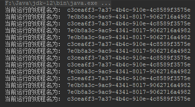
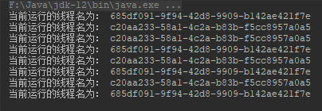
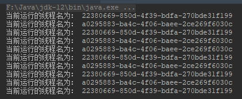
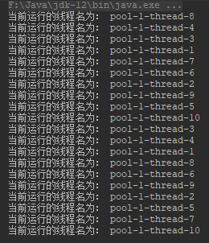

## Java多线程的7种方式

### 1.继承Thread类

*CustomThread.java*

```java
public class CustomThread extends Thread {

    @Override
    public void run() {
        while (true) {
            printThreadInfo();

            try {
                Thread.sleep(1000);
            } catch (InterruptedException ex) {
                ex.printStackTrace();
            }
        }
    }

    private void printThreadInfo() {
        System.out.println("当前运行的线程名为： " + Thread.currentThread().getName());
    }
}
```

*CustomThreadTest.java*

```java
public class CustomThreadTest {

    public static void main(String[] args) {
        CustomThread thread1 = new CustomThread();
        thread1.setName("c3cea6f3-7a37-4b4c-910e-4c8589f3575e");
        thread1.start();

        CustomThread thread2 = new CustomThread();
        thread2.setName("7e0b8a3c-9ac9-4341-8017-9062716a4982");
        thread2.start();
    }
}
```



### 2.实现Runnable接口

*CustomRunnable.java*

```java
public class CustomRunnable implements Runnable {

    @Override
    public void run() {
        while (true) {
            printThreadInfo();

            try {
                Thread.sleep(1000);
            } catch (InterruptedException ex) {
                ex.printStackTrace();
            }
        }
    }

    private void printThreadInfo() {
        System.out.println("当前运行的线程名为： " + Thread.currentThread().getName());
    }
}
```

*CustomRunnableTest.java*

```java
public class CustomRunnableTest {

    public static void main(String[] args) {
        CustomRunnable runnable = new CustomRunnable();
        Thread thread1 = new Thread(runnable);
        thread1.setName("685df091-9f94-42d8-9909-b142ae421f7e");
        thread1.start();

        Thread thread2 = new Thread(runnable);
        thread2.setName("c20aa233-58a1-4c2a-b83b-f5cc8957a0a5");
        thread2.start();
    }
}
```



### 3.基于Runnable和Lamdba

*RunnableLambdaTest.java*

```java
public class RunnableLambdaTest {

    public static void main(String[] args) {

        RunnableLambdaTest test = new RunnableLambdaTest();

        Runnable runnable = () -> {
            while (true) {
                test.printThreadInfo();

                try {
                    Thread.sleep(1000);
                } catch (InterruptedException ex) {
                    ex.printStackTrace();
                }
            }
        };

        Thread thread1 = new Thread(runnable);
        thread1.setName("a0295883-ba4c-4f06-baee-2ce269f6030c");
        thread1.start();

        Thread thread2 = new Thread(runnable);
        thread2.setName("22380669-850d-4f39-bdfa-270bde31f199");
        thread2.start();
    }

    private void printThreadInfo() {
        System.out.println("当前运行的线程名为： " + Thread.currentThread().getName());
    }
}
```



### 4.匿名类

```java
public class AnonymousTest {

    public static void main(String[] args) {
        AnonymousTest test = new AnonymousTest();

        new Thread() {
            @Override
            public void run() {
                while (true) {
                    test.printThreadInfo();

                    try {
                        Thread.sleep(1000);
                    } catch (InterruptedException ex) {
                        ex.printStackTrace();
                    }
                }
            }
        }.start();

        new Thread(new Runnable() {
            @Override
            public void run() {
                while (true) {
                    test.printThreadInfo();

                    try {
                        Thread.sleep(1000);
                    } catch (InterruptedException ex) {
                        ex.printStackTrace();
                    }
                }
            }
        }).start();
    }

    private void printThreadInfo() {
        System.out.println("当前运行的线程名为： " + Thread.currentThread().getName());
    }
}
```

### 5.Timer

使用`Timer`处理定时只执行一次的任务，可以这样写：

*TimerTest.java*

```java
public class TimerTest {

    public static void main(String[] args) {
        TimerTest test = new TimerTest();
        SimpleDateFormat format = new SimpleDateFormat("yyyy-MM-dd hh:mm:ss");

        Timer timer = new Timer();
        try {
            timer.schedule(new TimerTask() {
                @Override
                public void run() {
                    test.printThreadInfo();
                }
            }, format.parse("2019-06-24 11:41:00"));
        } catch (ParseException ex) {
            ex.printStackTrace();
        }
    }

    private void printThreadInfo() {
        System.out.println("当前运行的线程名为： " + Thread.currentThread().getName());
    }
}
```

使用`Timer`进行定时，重复执行的任务时，可以这样写：

*TimerTest2.java*

```java
public class TimerTest2 {

    public static void main(String[] args) {
        TimerTest2 test = new TimerTest2();
        Timer timer = new Timer();
        timer.schedule(new TimerTask() {
            @Override
            public void run() {
                test.printThreadInfo();
            }
        }, new Date(), 1000);
    }

    private void printThreadInfo() {
        System.out.println("当前运行的线程名为： " + Thread.currentThread().getName());
    }
}
```

### 6.基于Callable

基于`Callable`的多线程是携带返回值的，返回值类型是可以任意指定。而在通过`FutureTask.get()`获取返回值时，会产生阻塞。如下：

```java
public class CustomCallable {

    public static void main(String[] args) {
        CustomCallable callable = new CustomCallable();

        // 创建线程任务
        Callable<Integer> call = () -> {
            callable.printThreadInfo();
            Thread.sleep(3000);
            return 1;
        };

        // 将任务封装为FutureTask
        FutureTask<Integer> task = new FutureTask<>(call);

        // 开启线程，执行线程任务
        new Thread(task).start();

        // 获取线程结果
        Integer result = 0;
        try {
            result = task.get(); // 这里获取结果会阻塞
        } catch (InterruptedException | ExecutionException ex) {
            ex.printStackTrace();
        }

        System.out.println(String.format("result = %d", result));
    }

    private void printThreadInfo() {
        System.out.println("当前运行的线程名为： " + Thread.currentThread().getName());
    }
}
```

### 7.基于线程池

这里使用Java自带线程池`ExecutorService`。这里测试每1秒种生成10条子线程。

```java
public class ThreadPoolTest {

    public static void main(String[] args) {
        ExecutorService service = Executors.newFixedThreadPool(10);

        while (true) {
            service.execute(() -> new ThreadPoolTest().printThreadInfo());
        }
    }

    private void printThreadInfo() {
        System.out.println("当前运行的线程名为： " + Thread.currentThread().getName());

        try {
            Thread.sleep(1000);
        } catch (InterruptedException ex) {
            ex.printStackTrace();
        }
    }
}
```



从结果中子线程的生成顺序来看，这并不是按照有序打印的。由于线程创建后，到实际执行，这是一个时间不确定的过程，所以最后打印出来的线程序列并非有序。

------------

- [Github](https://github.com/qwhai)
- [Blog<sup>csdn</sup>](https://qwhai.blog.csdn.net)
- [E-mail](return_zero0@163.com)
