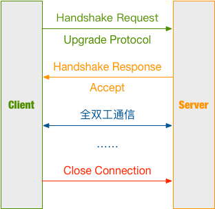

## 基于Spring boot进行Websocket开发浅析

在网络编程的协议模型中，有TCP/UDP，也有HTTP/HTTPS。前者需要先建立一个长连接，然后通过流的形式进行通信；后者是建立在前者的基础之上的，是更高层次的封装，HTTP是一种无状态的通信模式。正因为无状态，所以HTTP只能由客户端发起会话，服务端进行应答。<br>
而Websocket则是建立在TCP之上的一种全双工通信协议模型。

### WebSocket通信过程

WebSocket的通信过程大致如下图所示：



1.客户端发送建立连接请求<br>
2.服务端应答，响应可连接消息<br>
3.客户端与服务端进行全双工通信<br>
4.通信结束，关闭连接

### 基于Java的Websocket示例

通过上面的Websocket通信过程图了解到服务端与客户端是全双工通信，那么他们在接收Websocket消息与发送消息的过程也基本类似。大致有如下几种消息：

1. OnOpen -- 连接已建立

2. OnMessage -- 接收到数据

3. OnError -- 通信过程发生错误

4. OnClose -- 连接已关闭

**服务端**

*WebSocketConfig.java*

```java
@Configuration
public class WebSocketConfig {
    @Bean
    public ServerEndpointExporter serverEndpointExporter() {
        return new ServerEndpointExporter();
    }
}
```

*MyWebSocket.java*

```java
@ServerEndpoint(value = "/websocket")
@Component
public class MyWebSocket {

    //静态变量，用来记录当前在线连接数。应该把它设计成线程安全的。
    private static int onlineCount = 0;
    //concurrent包的线程安全Set，用来存放每个客户端对应的MyWebSocket对象。
    private static CopyOnWriteArraySet<MyWebSocket> webSocketSet = new CopyOnWriteArraySet<>();
    //与某个客户端的连接会话，需要通过它来给客户端发送数据
    private Session session;
    /**
     * 连接建立成功调用的方法
     */
    @OnOpen
    public void onOpen(Session session) {
        this.session = session;
        webSocketSet.add(this);     //加入set中
        addOnlineCount();           //在线数加1
        System.out.println("有新连接加入！当前在线人数为" + getOnlineCount());
        try {
            sendMessage("连接成功");
        } catch (IOException e) {
            System.out.println("IO异常");
        }
    }
    /**
     * 连接关闭调用的方法
     */
    @OnClose
    public void onClose() {
        webSocketSet.remove(this);  //从set中删除
        subOnlineCount();           //在线数减1
        System.out.println("有一连接关闭！当前在线人数为" + getOnlineCount());
    }
    /**
     * 收到客户端消息后调用的方法
     *
     * @param message 客户端发送过来的消息*/
    @OnMessage
    public void onMessage(String message, Session session) {
        System.out.println("来自客户端的消息:" + message);
        //群发消息
        for (MyWebSocket item : webSocketSet) {
            try {
                item.sendMessage(message);
            } catch (IOException e) {
                e.printStackTrace();
            }
        }
    }
    /**
     * 发生错误时调用
     */
    @OnError
    public void onError(Session session, Throwable error) {
        System.out.println("发生错误");
        error.printStackTrace();
    }

    /**
     * 群发自定义消息
     */
    public static void sendInfo(String message) throws IOException {
        for (MyWebSocket item : webSocketSet) {
            try {
                item.sendMessage(message);
            } catch (IOException ex) {
                ex.printStackTrace();
            }
        }
    }

    private void sendMessage(String message) throws IOException {
        this.session.getBasicRemote().sendText(message);
        //this.session.getAsyncRemote().sendText(message);
    }
    private static synchronized int getOnlineCount() {
        return onlineCount;
    }
    private static synchronized void addOnlineCount() {
        MyWebSocket.onlineCount++;
    }
    private static synchronized void subOnlineCount() {
        MyWebSocket.onlineCount--;
    }
}
```

注：这里一定要添加`@Component`注解，不然无法建立连接。

**客户端**

```html
<!DOCTYPE HTML>
<html>
<head>
    <title>My WebSocket</title>
</head>

<body>
Welcome<br/>
<input id="text" type="text" /><button onclick="send()">Send</button>    <button onclick="closeWebSocket()">Close</button>
<div id="message">
</div>
</body>

<script type="text/javascript">
    var websocket = null;

    // 判断当前浏览器是否支持WebSocket
    if('WebSocket' in window){
        websocket = new WebSocket("wss://localhost:23121/websocket");
    } else {
        alert('Not support websocket')
    }

    // 连接发生错误的回调方法
    websocket.onerror = function(){
        setMessageInnerHTML("error");
    };

    // 连接成功建立的回调方法
    websocket.onopen = function(event){
        setMessageInnerHTML("open");
    }

    // 接收到消息的回调方法
    websocket.onmessage = function(event){
        setMessageInnerHTML(event.data);
    }

    // 连接关闭的回调方法
    websocket.onclose = function(){
        setMessageInnerHTML("close");
    }

    // 监听窗口关闭事件，当窗口关闭时，主动去关闭websocket连接，防止连接还没断开就关闭窗口，server端会抛异常。
    window.onbeforeunload = function(){
        websocket.close();
    }

    // 将消息显示在网页上
    function setMessageInnerHTML(innerHTML){
        document.getElementById('message').innerHTML += innerHTML + '<br/>';
    }

    // 关闭连接
    function closeWebSocket(){
        websocket.close();
    }

    // 发送消息
    function send(){
        var message = document.getElementById('text').value;
        websocket.send(message);
    }
</script>
</html>
```

注意：这边使用的是`wss`，也就是使用SSL进行加密的Websocket。使用加密的Websocket方式与使用HTTPS的方式一样。

### Ref

- [https://segmentfault.com/a/1190000014643900](https://segmentfault.com/a/1190000014643900)

------------

- [Github](https://github.com/qwhai)
- [Blog<sup>csdn</sup>](https://qwhai.blog.csdn.net)
- [E-mail](return_zero0@163.com)
- [https://github.com/blog-demos/simple-springboot](https://github.com/blog-demos/simple-springboot)
