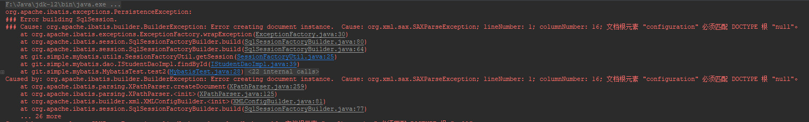
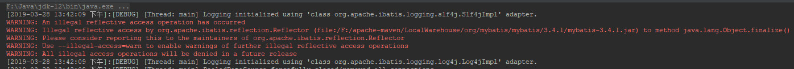
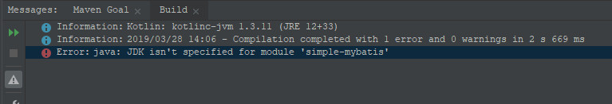

### org.apache.ibatis.exceptions.PersistenceException
> Cause: org.xml.sax.SAXParseException; lineNumber: 1; columnNumber: 16; 文档根元素 "configuration" 必须匹配 DOCTYPE 根 "null"。



解决方案：

为`mybatis-config.xml`添加头信息
```xml
<?xml version="1.0" encoding="UTF-8"?>
<!DOCTYPE configuration
        PUBLIC "-//mybatis.org//DTD Config 3.0//EN"
        "http://mybatis.org/dtd/mybatis-3-config.dtd">
<configuration>
    ... ...
```

### An illegal reflective access operation has occurred
> WARNING: An illegal reflective access operation has occurred<br>
> WARNING: Illegal reflective access by org.apache.ibatis.reflection.Reflector (file:/F:/apache-maven/LocalWarehouse/org/mybatis/mybatis/3.4.1/mybatis-3.4.1.jar) to method java.lang.Object.finalize()<br>
> WARNING: Please consider reporting this to the maintainers of org.apache.ibatis.reflection.Reflector<br>
> WARNING: Use --illegal-access=warn to enable warnings of further illegal reflective access operations<br>
> WARNING: All illegal access operations will be denied in a future release



这里可能是jdk的版本问题，换回jdk1.8或之前版本即可。

### Error:java: JDK isn't specified for module 'simple-mybatis'



这是由于我使用`git clean`操作将删除了`.idea`文件夹。我们可以重启`IntelliJ IDEA`，并刷新`maven`来解决。
