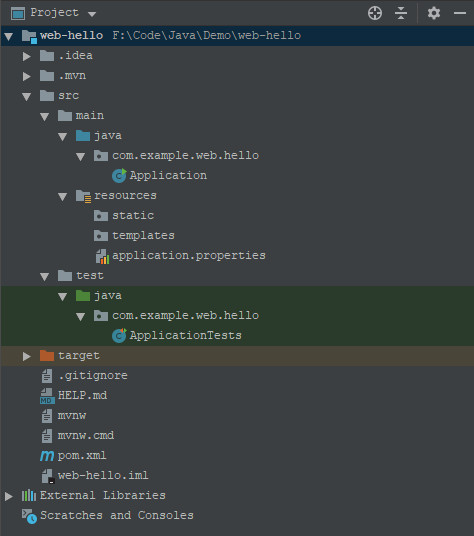

## 基于Spring boot构建Web版HelloWorld

### 1.IntelliJ IDEA 安装 Spring 插件

File -> Settings -> Plugins -> 搜索`Spring Assistant` -> 重启 IntelliJ IDEA


### 2.Create Project
File -> New -> Project -> 选择`Spring Assistant`


### 3.项目配置

上面的步骤下一步之后，就可以看到项目的配置过程了。如下：


### 4.Coding

项目构建完成之后，会自动生成如下代码结构：



`Application.java`代码如下：
```java
@SpringBootApplication
public class Application {

	public static void main(String[] args) {
		SpringApplication.run(Application.class, args);
	}
}
```
我们运行此`Application.main`，抛出以下异常:


从异常中可以看出这里缺少`mapping`，我们编写以下`Controller`代码。
```java
@RestController
public class HelloController {

    @RequestMapping(value = "/hello", method = RequestMethod.GET)
    public String say() {
        return "Hello Spring boost.";
    }
}
```


带参数的访问则见以下代码：
```java
@RestController
public class HelloController {

    // eg: http://localhost:9999/hello2/bob/16
    @RequestMapping(value = "/hello2/{name}/{age}", method = RequestMethod.GET)
    public String say2(@PathVariable("name") String name, @PathVariable("age") int age) {
        return String.format("Name: %s<br>Age: %d", name, age);
    }

    // eg: http://localhost:9999/hello3?name=bob&age=16
    @RequestMapping(value = "/hello3", method = RequestMethod.GET)
    public String say3(@RequestParam String name, @RequestParam int age) {
        return String.format("Name: %s<br>Age: %d", name, age);
    }
}
```
