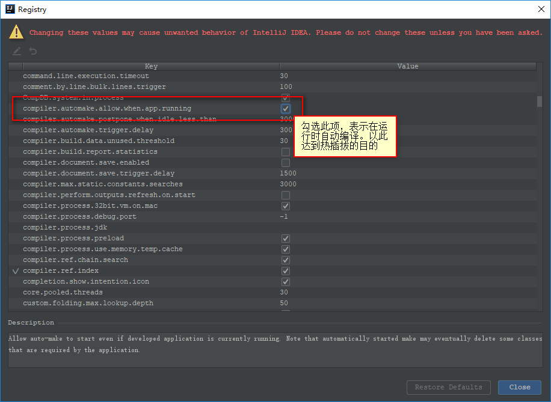

## 基于Springboot的Web程序热部署方案

>我们希望我们对代码的改动可以绕过重新编译这一步自动发布。于是我找到以下几个方案。

### spring-boot-devtools

> xxx

1. maven
<br>

2. maintenance
<br>

3. registry
<br>

4. restart
<br>这里需要重启`idea`后才会生效。

5. run
```shell
mvn clean spring-boot:run
```

### springloaded

> 待定

### Ref
- https://blog.csdn.net/wjc475869/article/details/52442484

-------------------

- [Github](https://github.com/qwhai)
