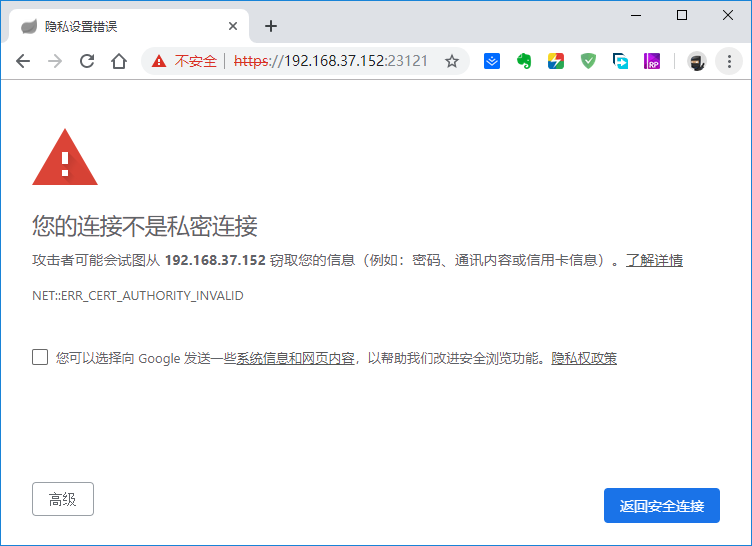
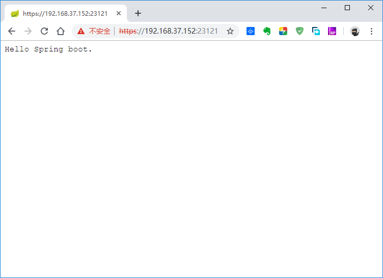

## Spring boot配置HTTPS服务

### 配置

**1.生成证书**

生成证书用到的是jdk自带的`keytool`工具，位于`%JAVA_HOME%/bin`下。

```shell
keytool -genkey -alias <keystore_alias> -storetype <storetype> -keyalg <encrypt_algorithm> -keysize <byte_len> -keystore <keystore_path> -validity <days>
```
*Example:*
```shell
keytool -genkey -alias mykeys1 -storetype PKCS12 -keyalg RSA -keysize 2048 -keystore f:/keystore/keystore.p12 -validity 3650
```

**2.properties**

这一步在Spring boot中配置`application.properties`，相关配置如下：

```properties
# 端口设置
server.port=23121

# HTTPS通道设置
server.ssl.key-store=classpath:keystore.p12
server.ssl.key-store-password=123456
server.ssl.key-password=123456
server.ssl.key-alias=mykeys1
server.ssl.key-store-type=PKCS12
```

设置`application.properties`的`server.ssl.key-store`时，可以像这样设置，也可以通过绝对路径配置。<br>
使用`classpath`配置时，证书`keystore.p12`的位置在`src/main/resources/keystore.p12`

**3.maven**

由于第一步中`storetype`设置的类型为`PKCS12`，不是默认类型，所以这里需要添加禁止过滤配置。如下：

```xml
<plugins>
    <plugin>
        <groupId>org.apache.maven.plugins</groupId>
        <artifactId>maven-resources-plugin</artifactId>
        <configuration>
            <encoding>UTF-8</encoding>
            <!-- 过滤后缀为pem、pfx的证书文件 -->
            <nonFilteredFileExtensions>
                <nonFilteredFileExtension>pem</nonFilteredFileExtension>
                <nonFilteredFileExtension>pfx</nonFilteredFileExtension>
                <nonFilteredFileExtension>p12</nonFilteredFileExtension>
            </nonFilteredFileExtensions>
        </configuration>
    </plugin>
</plugins>
```

**4.访问网页**

通过访问`https://192.168.37.152:23121`即可访问HTTPS服务。如下：



通过[高级]选项后，可正确访问，并获取正确的数据。如下：



### 附录

*附录一：SLL配置*

| 配置                            | 描述                                                         |
|:-------------------------------:|:-------------------------------------------------------------|
| server.ssl.ciphers              | 是否支持SSL ciphers                                          |
| server.ssl.client-auth          | 设定client authentication是wanted 还是 needed                |
| server.ssl.enabled              | 是否开启ssl，默认: true                                      |
| server.ssl.key-alias            | 设定key store中key的别名                                     |
| server.ssl.key-password         | 访问key store中key的密码                                     |
| server.ssl.key-store            | 设定持有SSL certificate的key store的路径，通常是一个.jks文件 |
| server.ssl.key-store-password   | 设定访问key store的密码                                      |
| server.ssl.key-store-provider   | 设定key store的提供者                                        |
| server.ssl.key-store-type       | 设定key store的类型                                          |
| server.ssl.protocol             | 使用的SSL协议，默认: TLS                                     |
| server.ssl.trust-store          | 持有SSL certificates的Trust store                            |
| server.ssl.trust-store-password | 访问trust store的密码                                        |
| server.ssl.trust-store-provider | 设定trust store的提供者                                      |
| server.ssl.trust-store-type     | 指定trust store的类型                                        |

*附录二：keytool command ops*

| 操作命令        | 描述                           |
|:----------------|:-------------------------------|
| -certreq        | 生成证书请求                   |
| -changealias    | 更改条目的别名                 |
| -delete         | 删除条目                       |
| -exportcert     | 导出证书                       |
| -genkeypair     | 生成密钥对                     |
| -genseckey      | 生成密钥                       |
| -gencert        | 根据证书请求生成证书           |
| -importcert     | 导入证书或证书链               |
| -importpass     | 导入口令                       |
| -importkeystore | 从其他密钥库导入一个或所有条目 |
| -keypasswd      | 更改条目的密钥口令             |
| -list           | 列出密钥库中的条目             |
| -printcert      | 打印证书内容                   |
| -printcertreq   | 打印证书请求的内容             |
| -printcrl       | 打印 CRL 文件的内容            |
| -storepasswd    | 更改密钥库的存储口令           |

*附录三：keytool -genkey command ops*

| 操作选项                       | 描述                    |
|:-------------------------------|:------------------------|
| -alias <alias>                 | 要处理的条目的别名      |
| -keyalg <keyalg>               | 密钥算法名称            |
| -keysize <keysize>             | 密钥位大小              |
| -sigalg <sigalg>               | 签名算法名称            |
| -destalias <destalias>         | 目标别名                |
| -dname <dname>                 | 唯一判别名              |
| -startdate <startdate>         | 证书有效期开始日期/时间 |
| -ext <value>                   | X.509 扩展              |
| -validity <valDays>            | 有效天数                |
| -keypass <arg>                 | 密钥口令                |
| -keystore <keystore>           | 密钥库名称              |
| -storepass <arg>               | 密钥库口令              |
| -storetype <storetype>         | 密钥库类型              |
| -providername <providername>   | 提供方名称              |
| -providerclass <providerclass> | 提供方类名              |
| -providerarg <arg>             | 提供方参数              |
| -providerpath <pathlist>       | 提供方类路径            |
| -v                             | 详细输出                |
| -protected                     | 通过受保护的机制的口令  |

-----

- [Github](https://github.com/qwhai)
- [Blog<sup>csdn</sup>](https://qwhai.blog.csdn.net)
- [E-mail](return_zero0@163.com)
