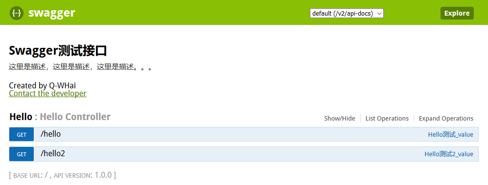

## 在Spring boot中集成Swagger2

> 关于如何构建Spring Boot程序可以查看：《[基于Spring boot构建Web版HelloWorld](02.基于Spring%20boot构建Web版HelloWorld.md)》

### Maven

```xml
<dependencies>
	<!-- swagger2 -->
	<!-- swagger本身不支持spring mvc的，springfox把swagger包装了一下，让他可以支持springmvc -->
	<dependency>
		<groupId>io.springfox</groupId>
		<artifactId>springfox-swagger2</artifactId>
		<version>2.6.1</version>
	</dependency>
	<dependency>
		<groupId>io.springfox</groupId>
		<artifactId>springfox-swagger-ui</artifactId>
		<version>2.6.1</version>
	</dependency>
</dependencies>
```

### Swagger启动类

> SwaggerConfig<br>
> 这里`SwaggerConfig`类需要与主启动类在同一级目录。

```java
@Configuration      // 声明该类为配置类
@EnableSwagger2     // 声明启动Swagger2
public class SwaggerConfig {

    @Bean
    public Docket customDocket() {
        return new Docket(DocumentationType.SWAGGER_2)
                .apiInfo(apiInfo())
                .select()
                .apis(RequestHandlerSelectors.basePackage("com.example.demo.controller")) // 扫描的包路径
                .paths(PathSelectors.any())
                .build();
    }

    private ApiInfo apiInfo() {
        return new ApiInfoBuilder()
                .title("Swagger测试接口")
                .version("1.0.0")
                .contact(new Contact("Q-WHai", "", "return_zero0@163.com"))
                .description("这里是描述，这里是描述，这里是描述。。。")
                .build();
    }
}
```

### 添加接口Api配置

*无参*

```java
@RestController
@Api(value = "Hello测试", tags = "Hello")
public class HelloController {

    @ApiOperation(value = "Hello测试_value", notes = "Hello测试_notes")
    @ApiResponses({
            @ApiResponse(code = 400, message = "请求参数没有填好"),
            @ApiResponse(code = 404, message = "请求路径没有找到")
    })
    @RequestMapping(value = "/hello", method = RequestMethod.GET)
    public String say() {
        return "Hello Spring boost.";
    }
}
```

*包含参数*
```java
@RestController
@Api(value = "Hello测试", tags = "Hello")
public class HelloController {

    @ApiOperation(value = "Hello测试2_value", notes = "Hello测试2_notes")
    @ApiImplicitParams({
            @ApiImplicitParam(name = "name", value = "姓名", paramType = "query", dataType = "String", example = "Alice", required = true),
            @ApiImplicitParam(name = "age", value = "年龄", paramType = "query", dataType = "int", example = "18")
    })
    @ApiResponses({
            @ApiResponse(code = 400, message = "请求参数没有填好"),
            @ApiResponse(code = 404, message = "请求路径没有找到")
    })
    @RequestMapping(value = "/hello2", method = RequestMethod.GET)
    public String say2(@RequestParam String name, @RequestParam int age) {
        return String.format("%d岁的%s，你好！", age, name);
    }
}
```

到这一步初步的工作就已经差不多结束了，需要最后将项目发布出去。再在浏览器通过链接访问：

<br>访问地址：[http://localhost:9999/swagger-ui.html](http://localhost:9999/swagger-ui.html)

------------

- [Github](https://github.com/qwhai)
- [Blog<sup>csdn</sup>](https://qwhai.blog.csdn.net)
- [E-mail](return_zero0@163.com)
