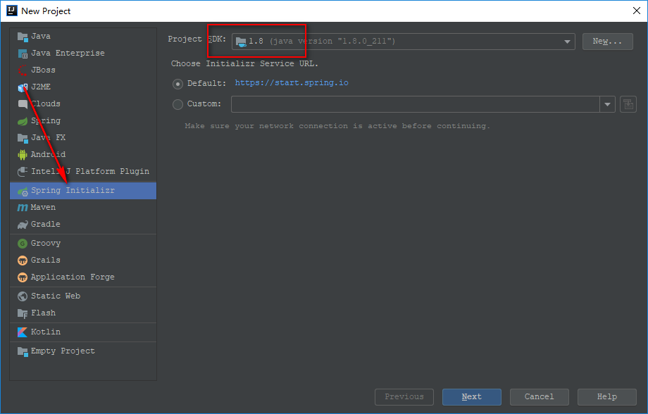
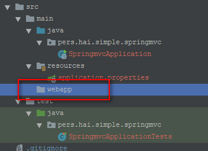
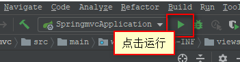

## 基于Maven构建Spring MVC初试

首先说明下本示例中使用的各环境及其版本。如下：

|  #  | 环境名称 | 版本 |
|:---:|:--------|:---:|
| 1 | IntelliJ IDEA | 2019.1 |
| 2 | Jdk | 1.8 |
| 3 | Maven | 3.6.0 |
| 4 | Spring boot | 2.1.6 |

### 构建步骤

**1.构建初步**

在新打开的`IntelliJ IDEA`窗口中选择New Project，或是在已打开的项目中选择File->New->Project... 来打开`New Project`窗口。



**2.填写项目名**

这里根据自己的项目需要，填写自己的`Group`和`Artifact`，其他选项可以默认（如果`Type`选项不是`Maven`就先调整到如图的Maven选项）。


**3.框架选择**

这一步不同的`IntelliJ IDEA`版本可能会出现不同的界面布局。我目前使用的是`2019.1`版本。


**4.编辑项目名**


**5.模块导入**

这一步可以选择`Enable Auto-Import`，这就一键完成了。如果是第一次构建Spring项目，可能会比较耗时。


**6.项目结构**

经过以上几步的构建，会生成下图所示的项目初始化结构：


**7.Maven依赖**

添加或修改`pom.xml`。（这里是最基本的maven配置，不同需求还需另行配置）

```xml
<dependencies>
    <!-- Spring 依赖 -->
    <dependency>
        <groupId>org.springframework.boot</groupId>
        <artifactId>spring-boot-starter-web</artifactId>
    </dependency>
    <dependency>
        <groupId>org.springframework.boot</groupId>
        <artifactId>spring-boot-starter-test</artifactId>
        <scope>test</scope>
    </dependency>

    <!-- 用于编译 jsp 的依赖 -->
    <dependency>
        <groupId>org.apache.tomcat.embed</groupId>
        <artifactId>tomcat-embed-jasper</artifactId>
        <scope>provided</scope>
    </dependency>
</dependencies>
```

**8.webapp**

在main目录下新建`webapp`文件夹，结构如下：



目前在这里新建的文件夹只是一个普通文件夹，还不是web资源目录。

**9.配置web资源目录**


能过配置web资源目录属性，使`webapp`成为web资源目录。这样原来普通的文件夹图标就变成了资源目录图标。<br>
这里要注意一下，如果之前没有在`pom.xml`中配置`spring-boot-starter-web`的依赖，那么在`Project Structure`中将找不到`Web`模块。

**10.application.properties**

这里可以通过`application.properties`来配置mvc相关的资源路径。如下：

```
server.port=20340

spring.mvc.view.prefix=/WEB-INF/views/
spring.mvc.view.suffix=.jsp
```

**11.index.jsp**

我们在之前的第`10`步设置了资源路径，那么这里的index.jsp就应该放在`webapp/WEB-INF/views/`下。像这样：


*index.jsp*

```html
<%@ page contentType="text/html;charset=UTF-8" language="java" %>
<html>
<head>
    <title>Spring MVC</title>
</head>
<body>
<p>Welcome Spring MVC</p>
</body>
</html>
```

**12.编写controller**

```java
@Controller
public class IndexController {

    @RequestMapping(value = "/index", method = RequestMethod.GET)
    public String index() {
        return "index";
    }
}
```

到这一步Spring MVC的构建就已经基本完成了。下面就是运行测试了。

**13.运行Spring MVC**



**14.访问**


-----

- [Github](https://github.com/qwhai)
- [Blog<sup>csdn</sup>](https://qwhai.blog.csdn.net)
- [E-mail](return_zero0@163.com)
- [https://github.com/blog-demos/simple-springmvc](https://github.com/blog-demos/simple-springmvc)
