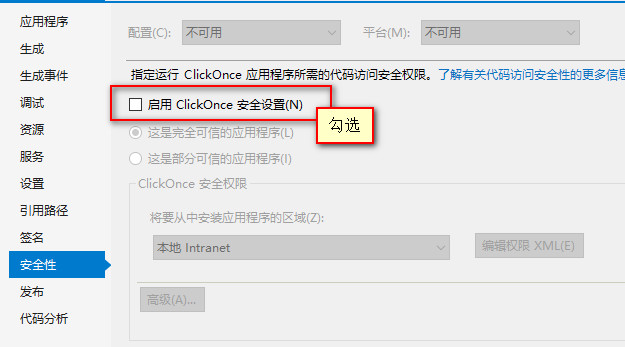
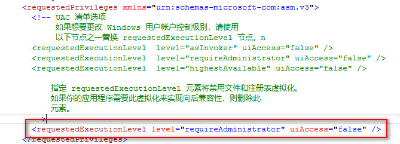
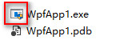
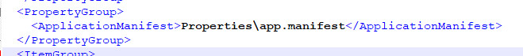

## 以管理员权限启动WPF程序

### 概述
> 以管理员权限启动WPF程序主要有三种方式：
> 1. 修改可执行文件的权限属性
> 2. 修改`app.manifest`
> 3. 通过`cs`代码动态处理启动权限
>
> 本文只从代码级，即后两种方式来说明管理员权限启动问题及这里隐藏的雷区。

### 全局修改

假设新建WPF项目`WpfApp1`。

**1. 开启安全性**

项目上右键 -> 安全性 -> 勾选`启用 ClickOnce 安全设置`



这时项目文件清单中会多一个`app.manifest`文件。

**2. UAC 清单选项**

打开`app.manifest`文件，作如下编辑。修改
```
<requestedExecutionLevel level="asInvoker" uiAccess="false" />
```
为
```
<requestedExecutionLevel level="requireAdministrator" uiAccess="false" />
```


**3. 关闭安全性**

项目上右键 -> 安全性 -> 不勾选`启用 ClickOnce 安全设置`

**4. 编译**

编译后，我们的程序图标上就会多一个小盾牌样子的下标



### 局部修改

局部修改是通过`c#`代码动态处理的，生成的可执行文件右下角也没有小盾牌图标。因为原理是启动自己后，又以管理员的方式再次启动自己，最后自己关闭自己。编码如下：

```csharp
private void RequireAdministrator(StartupEventArgs e)
{
    // 检测当前登录用户的组成员身份是否是管理员
    if (!new WindowsPrincipal(WindowsIdentity.GetCurrent()).IsInRole(WindowsBuiltInRole.Administrator))
    {
        ProcessStartInfo startInfo = new ProcessStartInfo(Assembly.GetExecutingAssembly().CodeBase); // 创建启动对象
        startInfo.Arguments = string.Join(" ", Environment.GetCommandLineArgs()); // 设置启动参数
        startInfo.Verb = "runas"; // 设置启动动作,确保以管理员身份运行
        Process.Start(startInfo); // 启动UAC
        Environment.Exit(0); // 退出
    }
}
```

这种方式的优点在于，只有当用户的操作需求达到了需要管理员操作时，才开始请求管理员权限（在用户体验上或许更好一些）。<br>
例如：
> 程序在普通用户登录下是不需要管理员权限的，只有当VIP用户登录时，才需要请求管理员权限（VIP用户拥有更多的功能）。

### 全局管理员失效问题

关于`全局管理员失效问题`也是在工作中实际遇到的。最后定位到问题是出在项目文件上。<br>
当我们按照**全局修改**的方式修改完成之后，`app.manifest`文件没有问题，但是程序启动时却不再请求管理员权限了，可执行文件右下角的小盾牌也不见了。<br>
后来发现这是因为项目文件`WpfApp1.csproj`中缺少对`app.manifest`文件的引用。



补全对`app.manifest`文件的引用后，编译，一样正常。
