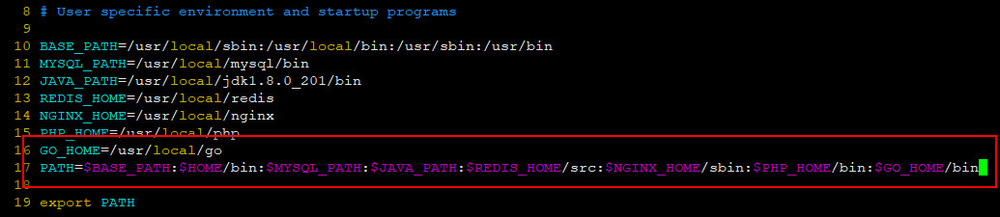

## Golang on CentOS7

### 0.SYSTEM

| Serial | Environment | Version                              |
|:------:|:-----------:|:-------------------------------------|
| 1      | ISO         | CentOS-7-x86_64-DVD-1810.iso         |
| 2      | Linux       | CentOS Linux release 7.6.1810 (Core) |
| 3      | Golang      | 1.12.1                               |

### 1.INSTALL

#### 1.1.downloads & unzip
```shell
cd ~/downloads
wget https://dl.google.com/go/go1.12.1.linux-amd64.tar.gz
```
```shell
tar -zxvf go1.12.1.linux-amd64.tar.gz;
mv ~/downloads/go /usr/local/go
```

#### 1.2.add to system environment variable
```shell
vim ~/.bash_profile
```

```shell
source ~/.bash_profile
```
