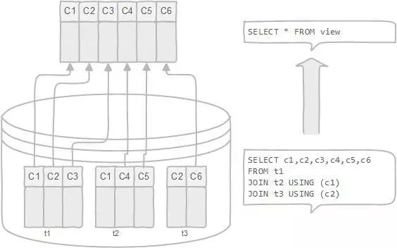
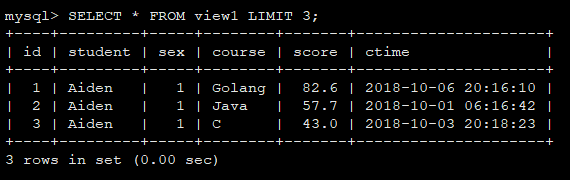
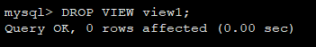

## 视图浅析

### 视图是什么

> 视图（view）是一种虚拟存在的表，是一个逻辑表，本身并不包含数据。作为一个select语句保存在数据字典中的。



### 视图应用场景

权限控制的时候，不希望用户访问表中某些含敏感信息的列，比如salary...<br>
关键信息来源于多个复杂关联表，可以创建视图提取我们需要的信息，简化操作；

### 数据准备

*student*
```
+-------+-----------------+------+-----+---------+----------------+
| Field | Type            | Null | Key | Default | Extra          |
+-------+-----------------+------+-----+---------+----------------+
| id    | int(11)         | NO   | PRI | NULL    | auto_increment |
| sno   | int(7) unsigned | NO   |     | NULL    |                |
| name  | varchar(20)     | NO   |     | NULL    |                |
| sex   | tinyint(1)      | NO   |     | NULL    |                |
| age   | smallint(6)     | NO   |     | NULL    |                |
| ctime | datetime        | NO   |     | NULL    |                |
+-------+-----------------+------+-----+---------+----------------+
```

*course*
```
+-------+-------------+------+-----+---------+----------------+
| Field | Type        | Null | Key | Default | Extra          |
+-------+-------------+------+-----+---------+----------------+
| id    | int(11)     | NO   | PRI | NULL    | auto_increment |
| cn    | smallint(5) | NO   |     | NULL    |                |
| name  | varchar(20) | YES  |     | NULL    |                |
+-------+-------------+------+-----+---------+----------------+
```

*score*
```
+-------+-------------+------+-----+---------+----------------+
| Field | Type        | Null | Key | Default | Extra          |
+-------+-------------+------+-----+---------+----------------+
| id    | int(11)     | NO   | PRI | NULL    | auto_increment |
| sno   | int(7)      | NO   |     | NULL    |                |
| cn    | smallint(5) | NO   |     | NULL    |                |
| score | double(3,1) | NO   |     | NULL    |                |
| ctime | datetime    | NO   |     | NULL    |                |
+-------+-------------+------+-----+---------+----------------+
```

*teacher*
```
+-------+-----------------+------+-----+---------+----------------+
| Field | Type            | Null | Key | Default | Extra          |
+-------+-----------------+------+-----+---------+----------------+
| id    | int(11)         | NO   | PRI | NULL    | auto_increment |
| sn    | int(7) unsigned | NO   |     | NULL    |                |
| name  | varchar(20)     | YES  |     | NULL    |                |
| sex   | tinyint(1)      | NO   |     | NULL    |                |
| age   | smallint(6)     | NO   |     | NULL    |                |
| ctime | datetime        | NO   |     | NULL    |                |
+-------+-----------------+------+-----+---------+----------------+
```

### 视图操作

#### 创建视图

**语法**

```sql
CREATE [OR REPLACE] [ALGORITHM = {UNDEFINED | MERGE | TEMPTABLE}]
    VIEW view_name [(column_list)]
    AS select_statement
   [WITH [CASCADED | LOCAL] CHECK OPTION]
```

**示例**

```sql
CREATE VIEW view1 AS
    SELECT
        sc.id,
        st.name AS student,
        st.sex,
        co.name AS course,
        sc.score,
        sc.ctime
    FROM
        student AS st,
        course AS co,
        score AS sc
    WHERE
        sc.sno=st.sno AND
        sc.cn=co.cn;
```

#### 查看视图

```sql
SHOW CREATE VIEW view1\G;
```
```
mysql> SHOW CREATE VIEW view1\G;
*************************** 1. row ***************************
                View: view1
         Create View: CREATE ALGORITHM=UNDEFINED DEFINER=`root`@`localhost` SQL SECURITY DEFINER VIEW `view1` AS select `sc`.`id` AS `id`,`st`.`name` AS `student`,`st`.`sex` AS `sex`,`co`.`name` AS `course`,`sc`.`score` AS `score`,`sc`.`ctime` AS `ctime` from ((`student` `st` join `course` `co`) join `score` `sc`) where ((`sc`.`sno` = `st`.`sno`) and (`sc`.`cn` = `co`.`cn`))
character_set_client: utf8
collation_connection: utf8_general_ci
1 row in set (0.00 sec)

ERROR:
No query specified
```

```sql
SELECT * FROM view1 LIMIT 3;
```



#### 更新视图

**语法**

```sql
ALTER
    [ALGORITHM = {UNDEFINED | MERGE | TEMPTABLE}]
    [DEFINER = { user | CURRENT_USER }]
    [SQL SECURITY { DEFINER | INVOKER }]
VIEW view_name [(column_list)]
AS select_statement
    [WITH [CASCADED | LOCAL] CHECK OPTION]
```

**示例**

```sql
CREATE OR REPLACE VIEW view1 AS
    SELECT
        sc.id,
        st.name AS student,
        st.sex,
        sc.score,
        sc.ctime
    FROM
        score AS sc
        INNER JOIN student AS st ON sc.sno=st.sno;
```

#### 嵌套视图

基于上一步更新后的视图`view1`，在其上做一层嵌套，创建`view2`。如下：

```sql
CREATE OR REPLACE VIEW view2 AS
    SELECT
        a.id,
        a.student,
        a.sex,
        b.name AS course,
        a.score,
        a.ctime
    FROM
        view1 AS a
        INNER JOIN course AS b ON a.cn=b.cn;
```

这个视图`view2`的效果与`最开始`创建的视图`view1`是一样的。

#### 撤销视图

**语法**

```sql
DROP VIEW [IF EXISTS]   
view_name [, view_name] ...
```

**示例**

```sql
DROP VIEW view1;
```



### 视图优缺点

*优点*

1. 数据库视图允许简化复杂查询：数据库视图由与许多基础表相关联的SQL语句定义。 您可以使用数据库视图来隐藏最终用户和外部应用程序的基础表的复杂性。 通过数据库视图，您只需使用简单的SQL语句，而不是使用具有多个连接的复杂的SQL语句。

2. 数据库视图有助于限制对特定用户的数据访问。 您可能不希望所有用户都可以查询敏感数据的子集。可以使用数据库视图将非敏感数据仅显示给特定用户组。

3. 数据库视图提供额外的安全层。 安全是任何关系数据库管理系统的重要组成部分。 数据库视图为数据库管理系统提供了额外的安全性。 数据库视图允许您创建只读视图，以将只读数据公开给特定用户。 用户只能以只读视图检索数据，但无法更新。

4. 数据库视图启用计算列。 数据库表不应该具有计算列，但数据库视图可以这样。 假设在orderDetails表中有quantityOrder(产品的数量)和priceEach(产品的价格)列。 但是，orderDetails表没有一个列用来存储订单的每个订单项的总销售额。如果有，数据库模式不是一个好的设计。 在这种情况下，您可以创建一个名为total的计算列，该列是quantityOrder和priceEach的乘积，以表示计算结果。当您从数据库视图中查询数据时，计算列的数据将随机计算产生。

5. 数据库视图实现向后兼容。 假设你有一个中央数据库，许多应用程序正在使用它。 有一天，您决定重新设计数据库以适应新的业务需求。删除一些表并创建新的表，并且不希望更改影响其他应用程序。在这种情况下，可以创建与将要删除的旧表相同的模式的数据库视图。

*缺点*

1. 性能：从数据库视图查询数据可能会很慢，特别是如果视图是基于其他视图创建的。

2. 表依赖关系：将根据数据库的基础表创建一个视图。每当更改与其相关联的表的结构时，都必须更改视图。

### Ref
- https://www.cnblogs.com/chenpi/p/5133648.html
- https://www.cnblogs.com/geaozhang/p/6792369.html
- https://blog.csdn.net/helloxiaozhe/article/details/80171899
