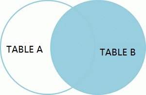
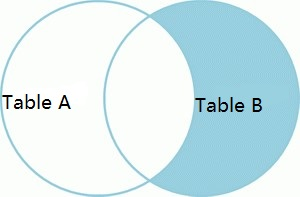

## MySQL中的7种join操作

### 内连接

内连接（inner join）操作可得到两张表中共同的部分，在维恩图中是相交的部分。


```sql
SELECT
    *
FROM
    tableA a INNER JOIN tableB b
ON
    a.id=b.id;
```

### 左连接

左连接（left join）操作可得到左表全部数据。


```sql
SELECT
    *
FROM
    tableA a LEFT JOIN tableB b
ON
    a.id=b.id;
```

### 右连接

右连接（right join）操作可得到右表全部数据。



```sql
SELECT
    *
FROM
    tableA a RIGHT JOIN tableB b
ON
    a.id=b.id;
```

### 左外连接

左外连接是指获取左表中所有且不包含右表中数据的部分。


```sql
SELECT
    *
FROM
    tableA a LEFT JOIN tableB b
ON
    a.id=b.id
WHERE
    b.id IS NULL;
```

### 右外连接

右外连接是指获取右表中所有且不包含左表中数据的部分。



```sql
SELECT
    *
FROM
    tableA a RIGHT JOIN tableB b
ON
    a.id=b.id
WHERE
    a.id IS NULL;
```

### 全连接

全连接是指包含左表和右表中全部的数据集。


```sql
SELECT * FROM tableA
UNION
SELECT * FROM tableB;
```

### 双外连接

双外连接是指左表中独有和右表中独有的合集。


```sql
SELECT * FROM tableA a RIGHT JOIN tableB b ON a.id=b.id WHERE a.id IS NULL
UNION
SELECT * FROM tableA a LEFT JOIN tableB b ON a.id=b.id WHERE b.id IS NULL;
```

### Ref

- [https://blog.csdn.net/zsl_955200/article/details/78759629](https://blog.csdn.net/zsl_955200/article/details/78759629)

-----

日期： 2019年07月15日

-----

- [Github](https://github.com/qwhai)
- [Blog<sup>csdn</sup>](https://qwhai.blog.csdn.net)
- [E-mail](return_zero0@163.com)
