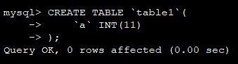
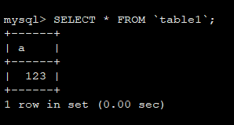
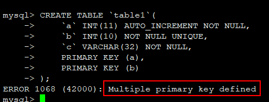

## MySQL的主键周边

### 1.主键的作用是什么？

设计数据时正常情况下会设计一个主键，主键的主要作用就是定位一行记录。

### 2.可不可以没有主键？

首先答案是肯定的，也就是说是可以没有主键的。例如，执行如下`SQL`：
```sql
CREATE TABLE `table1`(
    `a` INT(11)
);
```



然后，再向表中添加记录，是可以查到这条记录的。如下：



虽然通过示例表明，MySQL的表中是可以不设置主键的，但是其实，并不建议这样做，因为需求的变化你可能永远无法预知。

### 3.可不可以设置多个主键？

这个答案是否定的，例如，我们有如下数据表的创建过程。这里会报错：`ERROR 1068 (42000): Multiple primary key defined`。也就是说不能创建多个主键。

```sql
CREATE TABLE `table1`(
    `a` INT(11) AUTO_INCREMENT NOT NULL,
    `b` INT(10) NOT NULL UNIQUE,
    `c` VARCHAR(32) NOT NULL,
    PRIMARY KEY (a),
    PRIMARY KEY (b)
);
```



### 4.可不可合并多个字段为一个主键？

这个答案其实也是肯定的，就是说一张数据表中是可以将多个字段合并为一个主键，即合并主键。

```sql
CREATE TABLE `table1`(
    `a` INT(11) AUTO_INCREMENT NOT NULL,
    `b` INT(10) NOT NULL UNIQUE,
    `c` VARCHAR(32) NOT NULL,
    PRIMARY KEY (a,b)
);
```

-----

日期： 2019年08月05日

-----

- [Github](https://github.com/qwhai)
- [Blog<sup>csdn</sup>](https://qwhai.blog.csdn.net)
- [E-mail](return_zero0@163.com)
