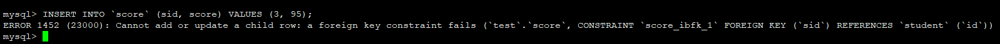
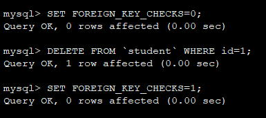

## MySQL外键的使用

> 定义：外键是指引用另外一个表中的一列或多列数据，被引用的列应该具有主键约束或者唯一性约束。外键用来建立和加强两个表数据之间的连接。

### 数据表设计

```sql
CREATE TABLE `student`(
    id INT AUTO_INCREMENT NOT NULL,
    sno INT(7) UNSIGNED NOT NULL COMMENT '学号 (2000001 ~ 2999999)',
    name VARCHAR (20) NOT NULL COMMENT '姓名',
    PRIMARY KEY (id)
);
```

```sql
CREATE TABLE `score`(
    id INT AUTO_INCREMENT NOT NULL,
    sid INT NOT NULL COMMENT '学号',
    score DOUBLE(3, 1) NOT NULL COMMENT '分数',
    PRIMARY KEY (id),
    FOREIGN KEY (sid) REFERENCES student( id )
);
```

### 添加数据

首先向`student`表中添加两行数据，如下：

```sql
INSERT INTO `student` (sno, name) VALUES (2000001, 'Liam');
INSERT INTO `student` (sno, name) VALUES (2000002, 'Lucas');
```

再向`score`表中添加两行数据，如下：

```sql
INSERT INTO `score` (sid, score) VALUES (1, 91);
INSERT INTO `score` (sid, score) VALUES (2, 90);
```

这样是没有问题的，因为添加的数据`sid`在`student`表中都是可以找到的。但是如果，我们这样添加数据：

```sql
INSERT INTO `score` (sid, score) VALUES (3, 95);
```
就会报错了，因为`sid`为3的数据是不存在的。



### 删除数据

在添加了外键约束后的数据表，我们不能直接删除主表中的相关数据。比如我想删除`student`表中`id`为`2`的数据。

```sql
DELETE FROM `student` WHERE id=2;
```

```
ERROR 1451 (23000): Cannot delete or update a parent row: a foreign key constraint fails (`test`.`score`, CONSTRAINT `score_ibfk_1` FOREIGN KEY (`sid`) REFERENCES `student` (`id`))
```

这是因为我们在删除数据的时候，外键约束的字段在其他从表中还存在相关数据。我们只要确认从表中数据已经被全部删除，这个时候就可以删除主表外键约束的数据了。

```sql
DELETE FROM `score` WHERE id=2;
DELETE FROM `student` WHERE id=2;
```

另外也可以通过降低外键约束检查（FOREIGN_KEY_CHECKS）的限制，来达到删除操作。



另：查看当前FOREIGN_KEY_CHECKS的值可以通过`SELECT @@FOREIGN_KEY_CHECKS;`获得。

# Ref

- [https://blog.csdn.net/u010695055/article/details/53169472](https://blog.csdn.net/u010695055/article/details/53169472)

-----

日期： 2019年08月05日

-----

- [Github](https://github.com/qwhai)
- [Blog<sup>csdn</sup>](https://qwhai.blog.csdn.net)
- [E-mail](return_zero0@163.com)
