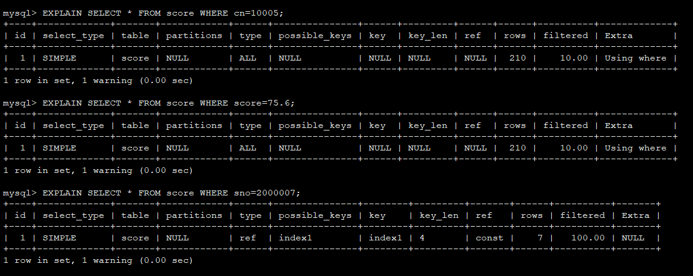

## MySQL索引深入理解

### 数据表背景

```
+-------+-------------+------+-----+---------+----------------+
| Field | Type        | Null | Key | Default | Extra          |
+-------+-------------+------+-----+---------+----------------+
| id    | int(11)     | NO   | PRI | NULL    | auto_increment |
| sno   | int(7)      | NO   | MUL | NULL    |                |
| cn    | smallint(5) | NO   |     | NULL    |                |
| score | double(3,1) | NO   |     | NULL    |                |
| ctime | datetime    | NO   |     | NULL    |                |
+-------+-------------+------+-----+---------+----------------+
```

数据表设计好之后，我们会向数据表中添加210行数据，并添加组合索引：(sno, cn, score)

### 是否可以通过组合索引中的部分字段进行查询

首先可以肯定的是可以通过组合索引中的部分字段进行查询，最坏的情况无非是全表扫描。<br>
上面我们创建了组合索引`(sno, cn, score)`，下面我们分别通过(sno, cn)、(sno, score)、(cn, score)进行定位查询：

```sql
EXPLAIN SELECT * FROM score WHERE sno=2000007 AND cn=10005;
```
```
+----+-------------+-------+------------+------+---------------+--------+---------+-------------+------+----------+-------+
| id | select_type | table | partitions | type | possible_keys | key    | key_len | ref         | rows | filtered | Extra |
+----+-------------+-------+------------+------+---------------+--------+---------+-------------+------+----------+-------+
|  1 | SIMPLE      | score | NULL       | ref  | index1        | index1 | 6       | const,const |    1 |   100.00 | NULL  |
+----+-------------+-------+------------+------+---------------+--------+---------+-------------+------+----------+-------+
```

```sql
EXPLAIN SELECT * FROM score WHERE sno=2000007 AND score=75.6;
```

```
+----+-------------+-------+------------+------+---------------+--------+---------+-------+------+----------+-----------------------+
| id | select_type | table | partitions | type | possible_keys | key    | key_len | ref   | rows | filtered | Extra                 |
+----+-------------+-------+------------+------+---------------+--------+---------+-------+------+----------+-----------------------+
|  1 | SIMPLE      | score | NULL       | ref  | index1        | index1 | 4       | const |    7 |    10.00 | Using index condition |
+----+-------------+-------+------------+------+---------------+--------+---------+-------+------+----------+-----------------------+
```

```sql
EXPLAIN SELECT * FROM score WHERE cn=10005 AND score=75.6;
```

```
+----+-------------+-------+------------+------+---------------+------+---------+------+------+----------+-------------+
| id | select_type | table | partitions | type | possible_keys | key  | key_len | ref  | rows | filtered | Extra       |
+----+-------------+-------+------------+------+---------------+------+---------+------+------+----------+-------------+
|  1 | SIMPLE      | score | NULL       | ALL  | NULL          | NULL | NULL    | NULL |  210 |     1.00 | Using where |
+----+-------------+-------+------------+------+---------------+------+---------+------+------+----------+-------------+
```



从这些`EXPLAIN`分析结果来看，只有当查询字段中包含了`sno`，type才会是`ref`。常用的类型有： ALL、index、range、 ref、eq_ref、const、system、NULL（从左到右，性能从差到好）。

总结：在使用组合索引时，只有当查询包含组合索引中的第一个字段，才能起到优化性能的作用。

### 索引类型的比较

> TODO

1. FULLTEXT
2. NORNAL
3. SPATIAL
4. UNIQUE

### 索引方法的比较

> TODO

1. BTREE
2. HASH

-----

日期： 2019年08月06日

-----

- [Github](https://github.com/qwhai)
- [Blog<sup>csdn</sup>](https://qwhai.blog.csdn.net)
- [E-mail](return_zero0@163.com)
