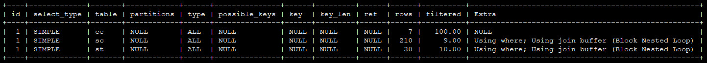
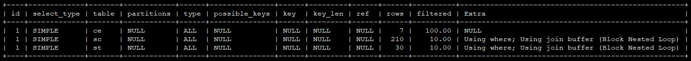

## 联合查询与子查询效率比较

### 1.数据准备
```sql
--- 创建数据库`cms`
CREATE DATABASE `cms` DEFAULT CHARACTER SET utf8;
USE `cms`;

--- 创建`student`数据表
CREATE TABLE `student`(
    id INT AUTO_INCREMENT NOT NULL,
    sno INT(7) UNSIGNED NOT NULL COMMENT '学号 (2000001 ~ 2999999)',
    name VARCHAR (20) NOT NULL COMMENT '姓名',
    sex TINYINT(1) NOT NULL COMMENT '性别',
    age SMALLINT NOT NULL COMMENT '年龄',
    ctime DATETIME NOT NULL COMMENT '入学时间',
    PRIMARY KEY (id)
);
--- 创建`teacher`数据表
CREATE TABLE `teacher`(
    id INT AUTO_INCREMENT NOT NULL,
    sn INT(7) UNSIGNED NOT NULL COMMENT '工号(Staff No)(1000001 ~ 1999999)',
    name VARCHAR (20) COMMENT '姓名',
    sex TINYINT(1) NOT NULL COMMENT '性别',
    age SMALLINT NOT NULL COMMENT '年龄',
    ctime DATETIME NOT NULL COMMENT '入职时间',
    PRIMARY KEY (id)
);
--- 创建`course`数据表
CREATE TABLE `course`(
    id INT AUTO_INCREMENT NOT NULL,
    cn SMALLINT(5) NOT NULL COMMENT '课程编号 (10001 ~ 99999)',
    name VARCHAR (20) COMMENT '课程名称',
    PRIMARY KEY (id)
);
--- 创建`score`数据表
CREATE TABLE `score`(
    id INT AUTO_INCREMENT NOT NULL,
    sno INT(7) NOT NULL COMMENT '学号',
    cn SMALLINT(5) NOT NULL COMMENT '课程编号',
    score DOUBLE(3, 1) NOT NULL COMMENT '分数',
    ctime DATETIME NOT NULL COMMENT '入表时间',
    PRIMARY KEY (id)
);
```

### 2.查询案例

#### 2.1.查询所有学生的成绩

```sql
```

```sql
SELECT
	st.name AS 姓名,
	ce.name AS 课程,
	sc.score AS 成绩
FROM
	score AS sc
	INNER JOIN student AS st ON sc.sno = st.sno
	AND score
	INNER JOIN course AS ce ON sc.cn = ce.cn;
```

```sql
EXPLAIN SELECT
	st.name AS 姓名,
	ce.name AS 课程,
	sc.score AS 成绩
FROM
	score AS sc
	INNER JOIN student AS st ON sc.sno = st.sno
	AND score
	INNER JOIN course AS ce ON sc.cn = ce.cn;
```



```sql
EXPLAIN SELECT
    st.name AS 姓名,
    ce.name AS 课程,
    sc.score AS 成绩
FROM
    student AS st,
    course AS ce,
    score AS sc
WHERE
    st.sno=sc.sno AND
    ce.cn=sc.cn;
```



#### 2.2.查询xxx

#### 2.3.查询xxx

### 3.总结
