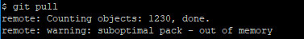

# Table Of Contents
1. remote: warning: suboptimal pack - out of memory

# remote: warning: suboptimal pack - out of memory
## Q
remote: warning: suboptimal pack - out of memory<br/>

## A
修改```C:\Users\xxx\.gitconfig```配置文件。添加以下配置信息：
```
[pack]
    window = 0
    deltaCacheSize = 128m
    packSizeLimit = 128m
    windowMemory = 128m
```
