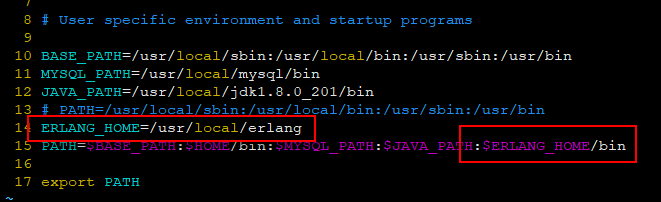
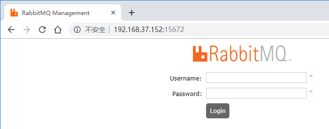

## CentOS 下安装 RabbitMQ

### 环境

| Serial | Environment | Version                              |
|:------:|:-----------:|:-------------------------------------|
| 1      | ISO         | CentOS-7-x86_64-DVD-1810.iso         |
| 2      | Linux       | CentOS Linux release 7.6.1810 (Core) |
| 3      | Java        | jdk/1.8                              |
| 4      | Erlang      | Erlang/19.3                          |
| 5      | RabbitMQ    | RabbitMQ/3.6.12                      |

### 安装

#### 安装依赖环境

```shell
yum -y install make gcc gcc-c++ kernel-devel m4 ncurses-devel openssl-devel unixODBC-devel
```

#### 安装Erlang

1.关于Erlang的下载地址可以参考：[http://erlang.org/download](http://erlang.org/download)。选择需要的版本进行安装

```shell
wget http://erlang.org/download/otp_src_19.3.tar.gz
```

2.解压

```shell
tar -zxvf otp_src_19.3.tar.gz
```

3.配置及编译

```shell
cd otp_src_19.3
```

```shell
./configure \
--prefix=/usr/local/erlang \
--with-ssl \
-enable-threads \
-enable-smmp-support \
-enable-kernel-poll \
--enable-hipe \
--without-javac
```

```shell
make && make install
```

4.检查


5.配置环境变量

打开配置文件（这里编辑的是只针对当前用户，如果需要对所有用户生效，可以编辑`/etc/profile`文件）
```shell
vim ~/.bash_profile
```

添加以下红框框中内容


使配置立即生效
```shell
source ~/.bash_profile
```

#### 安装RabbitMQ

1.RabbitMQ的下载地址：[https://www.rabbitmq.com/releases/rabbitmq-server/](https://www.rabbitmq.com/releases/rabbitmq-server/)。可以依据需求选择版本：

```shell
wget https://www.rabbitmq.com/releases/rabbitmq-server/v3.6.15/rabbitmq-server-generic-unix-3.6.15.tar.xz
```

2.解压

```shell
tar -vxf rabbitmq-server-generic-unix-3.6.15.tar.xz
```

3.将RabbitMQ移动到需要的位置

```shell
mv rabbitmq_server-3.6.15/ /usr/local/rabbitmq
```

4.配置环境变量

打开配置文件（这里编辑的是只针对当前用户，如果需要对所有用户生效，可以编辑`/etc/profile`文件）
```shell
vim ~/.bash_profile
```

添加以下红框框中内容


使配置立即生效
```shell
source ~/.bash_profile
```

#### RabbitMQ服务操作

```shell
# 启动。-detached表示在后台运行，xshell关闭后不会关闭rabbitmq
rabbitmq-server -detached
# 检查状态
rabbitmqctl status
```

#### RabbitMQ Web端

安装完RabbitMQ，是自动安装`rabbitmq_management`的。所以这里只需要执行以下命令即可：

```shell
rabbitmq-plugins enable rabbitmq_management
```

然后开放端口（默认是`15672`）

```shell
firewall-cmd --zone=public --add-port=15672/tcp --permanent
firewall-cmd --reload
firewall-cmd --zone=public --list-ports
```

添加用户

```shell
rabbitmqctl add_user [username] [password]
rabbitmqctl set_permissions -p "/" [username] ".*" ".*" ".*"
```

最后在浏览器中访问`http://192.168.37.152:15672/`（如果是localhost登录。默认用户名guest,密码guest）：



登录成功后


### Ref

- [https://programmer.group/rabbitmq-start-error-throw-error-missing_dependencies-crypto-ssl.html](https://programmer.group/rabbitmq-start-error-throw-error-missing_dependencies-crypto-ssl.html)

- [https://www.cnblogs.com/gne-hwz/p/10714013.html](https://www.cnblogs.com/gne-hwz/p/10714013.html)

-----

日期： 2019年07月09日

-----


- [Github](https://github.com/qwhai)
- [Blog<sup>csdn</sup>](https://qwhai.blog.csdn.net)
- [E-mail](return_zero0@163.com)
