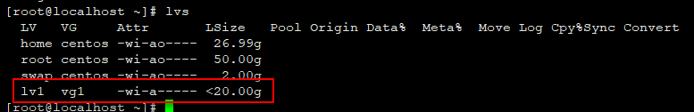

## 在CentOS中添加新磁盘

### 系统环境

| Serial | Environment | Version                              |
|:------:|:-----------:|:-------------------------------------|
| 1      | ISO         | CentOS-7-x86_64-DVD-1810.iso         |
| 2      | Linux       | CentOS Linux release 7.6.1810 (Core) |
| 3      | VMWare      | 14                                   |

### 名词解释

- PV（Physical Volume）-- 物理卷
<br>物理卷在逻辑卷管理中处于最底层，它可以是实际物理硬盘上的分区，也可以是整个物理硬盘，也可以是raid设备。

- VG（Volumne Group）-- 卷组
<br>卷组建立在物理卷之上，一个卷组中至少要包括一个物理卷，在卷组建立之后可动态添加物理卷到卷组中。一个逻辑卷管理系统工程中可以只有一个卷组，也可以拥有多个卷组。

- LV（Logical Volume）-- 逻辑卷
<br>逻辑卷建立在卷组之上，卷组中的未分配空间可以用于建立新的逻辑卷，逻辑卷建立后可以动态地扩展和缩小空间。系统中的多个逻辑卷可以属于同一个卷组，也可以属于不同的多个卷组。

### 挂载步骤

#### 1.查看当前磁盘信息

```shell
fdisk -l
```


#### 2.添加磁盘

在虚拟机中右键虚拟机A，点击设置选项，如图依次设置：


#### 3.再次查看磁盘信息

```shell
fdisk -l
```


#### 4.挂载
```shell
fdisk /dev/sdb
```
如下是命令的执行过程，包括子命令选项信息：
```text
[root@localhost ~]# fdisk /dev/sdb
Welcome to fdisk (util-linux 2.23.2).

Changes will remain in memory only, until you decide to write them.
Be careful before using the write command.

Device does not contain a recognized partition table
Building a new DOS disklabel with disk identifier 0x0b716d43.

Command (m for help): n
Partition type:
   p   primary (0 primary, 0 extended, 4 free)
   e   extended
Select (default p): p
Partition number (1-4, default 1): 1
First sector (2048-41943039, default 2048):
Using default value 2048
Last sector, +sectors or +size{K,M,G} (2048-41943039, default 41943039):
Using default value 41943039
Partition 1 of type Linux and of size 20 GiB is set

Command (m for help): t
Selected partition 1
Hex code (type L to list all codes): L

 0  Empty           24  NEC DOS         81  Minix / old Lin bf  Solaris        
 1  FAT12           27  Hidden NTFS Win 82  Linux swap / So c1  DRDOS/sec (FAT-
 2  XENIX root      39  Plan 9          83  Linux           c4  DRDOS/sec (FAT-
 3  XENIX usr       3c  PartitionMagic  84  OS/2 hidden C:  c6  DRDOS/sec (FAT-
 4  FAT16 <32M      40  Venix 80286     85  Linux extended  c7  Syrinx         
 5  Extended        41  PPC PReP Boot   86  NTFS volume set da  Non-FS data    
 6  FAT16           42  SFS             87  NTFS volume set db  CP/M / CTOS / .
 7  HPFS/NTFS/exFAT 4d  QNX4.x          88  Linux plaintext de  Dell Utility   
 8  AIX             4e  QNX4.x 2nd part 8e  Linux LVM       df  BootIt         
 9  AIX bootable    4f  QNX4.x 3rd part 93  Amoeba          e1  DOS access     
 a  OS/2 Boot Manag 50  OnTrack DM      94  Amoeba BBT      e3  DOS R/O        
 b  W95 FAT32       51  OnTrack DM6 Aux 9f  BSD/OS          e4  SpeedStor      
 c  W95 FAT32 (LBA) 52  CP/M            a0  IBM Thinkpad hi eb  BeOS fs        
 e  W95 FAT16 (LBA) 53  OnTrack DM6 Aux a5  FreeBSD         ee  GPT            
 f  W95 Ext'd (LBA) 54  OnTrackDM6      a6  OpenBSD         ef  EFI (FAT-12/16/
10  OPUS            55  EZ-Drive        a7  NeXTSTEP        f0  Linux/PA-RISC b
11  Hidden FAT12    56  Golden Bow      a8  Darwin UFS      f1  SpeedStor      
12  Compaq diagnost 5c  Priam Edisk     a9  NetBSD          f4  SpeedStor      
14  Hidden FAT16 <3 61  SpeedStor       ab  Darwin boot     f2  DOS secondary  
16  Hidden FAT16    63  GNU HURD or Sys af  HFS / HFS+      fb  VMware VMFS    
17  Hidden HPFS/NTF 64  Novell Netware  b7  BSDI fs         fc  VMware VMKCORE
18  AST SmartSleep  65  Novell Netware  b8  BSDI swap       fd  Linux raid auto
1b  Hidden W95 FAT3 70  DiskSecure Mult bb  Boot Wizard hid fe  LANstep        
1c  Hidden W95 FAT3 75  PC/IX           be  Solaris boot    ff  BBT            
1e  Hidden W95 FAT1 80  Old Minix      
Hex code (type L to list all codes): 8e
Changed type of partition 'Linux' to 'Linux LVM'

Command (m for help): p

Disk /dev/sdb: 21.5 GB, 21474836480 bytes, 41943040 sectors
Units = sectors of 1 * 512 = 512 bytes
Sector size (logical/physical): 512 bytes / 512 bytes
I/O size (minimum/optimal): 512 bytes / 512 bytes
Disk label type: dos
Disk identifier: 0x0b716d43

   Device Boot      Start         End      Blocks   Id  System
/dev/sdb1            2048    41943039    20970496   8e  Linux LVM

Command (m for help): w
The partition table has been altered!

Calling ioctl() to re-read partition table.
Syncing disks.
```
过程命令如下：
```shell
n -- 创建新分区
p -- 创建主分区
1 -- 默认分区编号 1
<Enter> -- 默认起始扇区位置。
<Enter> -- 默认结束扇区位置。
t -- 修改分区类型
L -- 查看列表
8e -- 修改为LVM
p -- 修改为LVM
w -- 保存
```

#### 5.重启

```shell
reboot
```

#### 6.再次查看磁盘信息

```shell
fdisk -l
```

<br><font color=#0000FF>可以看到这里的分区编号为`1`，`Id`是`8e`，`8e`即表示系统是`Linux LVM`。这些信息与之前`fdisk /dev/sdb`命令设置的信息一致。</font>

#### 7.物理卷：PV

*7.1 查看本机 PV*

```shell
pvs
```

<br><font color=#0000FF>此时仅有一个`/dev/sda2`，新添加的`/dev/sdb1`并未出现。所以需要将其添加进来。</font>

*7.2 创建 PV*

```shell
pvcreate /dev/sdb1
```


*7.3 验证*

此时通过命令`pvs`再检查一下本机PV


也可以通过`pvdisplay`命令查看明细，如下：


#### 8.卷组：VG

*8.1 查看本机 VG*
```shell
vgs
```


或是通过`vgdisplay`查看`VG`详细，如下：


*8.2 创建 VG*

上面检查到本机存在一个`VG`--`centos`。假设这里我们未检查到此 VG，那么就要创建一个新的 VG。

```shell
vgcreate vg1 /dev/sdb1
```


如果想将`/dev/sdb1`添加到一个已存在的vg中的话，可以像这样（假定vg2已存在）：

```shell
vgextend vg2 /dev/sdb1
```

*8.3 验证*

此时通过`vgs`命令查看本机`vg`列表


<br>可以看到这里已经添加成功。

如果再回过头检查 pv，可以发现`/dev/sdb1`已经添加到卷组`vg1`中了：


#### 9.逻辑卷：LV

*9.1 查看本机 LV*

通过对`PV`与`VG`的操作，此步操作已经了然纸上了：
```shell
lvs
```


<br><font color=#0000FF>这里可以看到本机已经有了三个逻辑分区：`home`, `root`, `swap`不过我们这里不使用这三个分区，我们将已经新建逻辑分区：`lv1`。
<br>（Note：其实上面一开始的`fdisk -l`命令中也罗列了这三项，因为与本文无关，故而被我隐去了，如果你在使用此命令出现了这个状况也不要惊讶，这是正常情况）</font>

*9.2 创建 LV*

```shell
lvcreate -l +100%FREE -n lv1 vg1
```
创建了一个名字为`lv1`，容量大小是`vg1`卷组的100%
<br>其中：
- -l：指定划分的百分比
- -L：指定LV的大小（`lvcreate -L 100M -n lv1 vg1`）
- -n：指定LV的名
- vg1：表示从这个VG中划分LV


如果是将vg1添加到一个已存在的lv中的话，可以像这样（假定lv2已存在）：

```shell
lvextend -l +100%FREE /dev/mapper/vg1-lv2
```

*9.3 验证*

此时通过`lvs`命令查看本机`lv`列表


<br>可以看到这里已经创建成功。

也可以通过`lvdisplay`命令查看详情（无关 LV 已隐去）：


#### 10.ext4文件系统

分区创建完成后，还没有结束，还需要在这个分区上创建文件系统。只有存在文件系统的分区才可以进行 IO 操作。

*1. 创建文件系统*

```shell
mkfs.ext4 /dev/vg1/lv1
```


#### 11.挂载

将初始化完成的逻辑分卷`lv1`挂载到`/data1`目录下：

```shell
mkdir /data1
mount /dev/vg1/lv1 /data1
```
```shell
mount | grep /data1
```


创建好之后,会在/dev/mapper/生成一个软连接名字为”卷组-逻辑卷”。本例中则是：`/dev/mapper/vg1-lv1`。


#### 12.同步文件系统

在向新创建的`VG`和`LV`挂载磁盘时，就可以直接获得上面第11步的结果了。可是，如果是向一个已存在的`VG`和`LV`中挂载磁盘时，必须进行文件系统同步操作（不同文件系统的同步命令有可能不一样）：

1. xfs
```shell
xfs_growfs /dev/vg1/lv1
```

2. ext4
```shell
resize2fs /dev/vg1/lv1
```

### 辅助命令

1. 查看当前文件系统格式
```shell
cat /etc/fstab
```

2. 删除逻辑卷
```shell
lvremove /dev/vg1/lv1
```

3. 删除卷组
```shell
vgremove /dev/vg1
```

4. 删除物理卷
```shell
pvremove /dev/sdb1
```

#### 13.重启自动挂载

*13.1 查询本机block列表*

```shell
blkid
```


*13.2 编辑自启动配置*

```shell
vim /etc/fstab
```

<br><font color=#0000FF>这里大家也看到了我将原来的`UUID`注释后，再新添加的`block`，是因为同一个目录下，只能挂载一块磁盘。</font>

其中每一列的属性描述如下：
- 第一列 -- Device：磁盘设备文件或者该设备的Label或者UUID
- 第二列 -- Mount point：设备的挂载点，就是你要挂载到哪个目录下
- 第三列 -- File System：磁盘文件系统的格式，包括ext2、ext3、reiserfs、nfs、vfat等
- 第四列 -- parameters：文件系统的参数
- 第五列 -- 能否被dump备份命令作用：dump是一个用来作为备份的命令。通常这个参数的值为0或者1
<br>（0:代表不要做dump备份 / 1:代表要每天进行dump的操作 / 2:代表不定日期的进行dump操作）
- 第六列 -- 是否检验扇区：开机的过程中，系统默认会以fsck检验我们系统是否为完整（clean）
<br>（0:不要检验 / 1:最早检验（一般根目录会选择） / 2:1级别检验完成之后进行检验）

### Ref
- http://m.111cn.net/art-102479.htm
- https://blog.csdn.net/yaofengyaofeng/article/details/82353282
- https://blog.51cto.com/dreamfire/1084729
- https://blog.csdn.net/mycms5/article/details/27218935

-----

日期： 2019年05月31日

-----

- [Github](https://github.com/qwhai)
- [Blog<sup>csdn</sup>](https://qwhai.blog.csdn.net)
- [E-mail](return_zero0@163.com)
