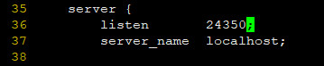
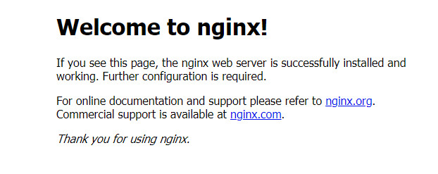

## Nginx On CentOS7.6

### SYSTEM

| Serial | Environment | Version                              |
|:------:|:-----------:|:-------------------------------------|
| 1      | ISO         | CentOS-7-x86_64-DVD-1810.iso         |
| 2      | Linux       | CentOS Linux release 7.6.1810 (Core) |
| 3      | Nginx       | 1.14.2                               |

### install
依赖包安装
```shell
yum install -y \
gcc-c++ \
pcre pcre-devel \
zlib zlib-devel \
openssl openssl-devel
```

https://nginx.org/en/download.html
```
wget -c https://nginx.org/download/nginx-1.14.2.tar.gz
```

```
tar -zxvf nginx-1.14.2.tar.gz
cd nginx-1.14.2
```

配置
```shell
mkdir -p /var/log/nginx /var/temp/nginx
```
```shell
./configure \
--prefix=/usr/local/nginx \
--conf-path=/usr/local/nginx/conf/nginx.conf \
--pid-path=/usr/local/nginx/conf/nginx.pid \
--lock-path=/var/lock/nginx.lock \
--error-log-path=/var/log/nginx/error.log \
--http-log-path=/var/log/nginx/access.log \
--with-http_gzip_static_module \
--http-client-body-temp-path=/var/temp/nginx/client \
--http-proxy-temp-path=/var/temp/nginx/proxy \
--http-fastcgi-temp-path=/var/temp/nginx/fastcgi \
--http-uwsgi-temp-path=/var/temp/nginx/uwsgi \
--http-scgi-temp-path=/var/temp/nginx/scgi
```

```shell
make && make install
```

查找安装路径：
```shell
whereis nginx
```
```
nginx: /usr/local/nginx
```

环境变量
```shell
vim ~/.bash_profile
```
```
NGINX_HOME=/usr/local/nginx
PATH=$BASE_PATH:$HOME/bin:$MYSQL_PATH:$JAVA_PATH:$REDIS_HOME/src:$NGINX_HOME/sbin
```
```shell
source ~/.bash_profile
```

nginx.conf
```
vim /usr/local/nginx/conf/nginx.conf
```


防火墙
```shell
firewall-cmd --zone=public --add-port=24350/tcp --permanent
firewall-cmd --reload
firewall-cmd --zone=public --list-ports
```

启动
```shell
nginx
```

http://192.168.37.152:24350/


### Ref
- https://www.cnblogs.com/kaid/p/7640723.html
