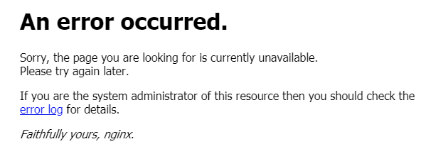

## Nginx反向代理Https站点

### 系统环境

| # | Environment | Version |
|:---:|:---:|:---|
| 1 | ISO | CentOS-7-x86_64-DVD-1810.iso |
| 2 | Linux | CentOS Linux release 7.6.1810 (Core) |
| 3 | Nginx | 1.14.2 |

假设现有以下服务器：

| # | domain | ip | port | desc |
|:---:|:---:|:---:|:---:|:---|
| 1 | test.nginx.com | 192.168.37.100 | 10340 | Nginx代理服务器 |
| 2 | test.abc1.com | 192.168.37.101 | 80 | 业务服务器1 |

现在我有一个需求，就是通过http的nginx代理服务器向一个https的站点做代理服务。例如，这里的业务服务器1就是一个https站点。我们要通过`http://test.nginx.com:10340`访问`https://test.abc1.com`的内容。<br>
如果直接访问，会报一个`ssl`的错。配置如下：

```
worker_processes  1;

events {
    worker_connections  1024;
}

http {
    include       mime.types;
    default_type  application/octet-stream;

    sendfile        on;
    keepalive_timeout  65;

    upstream server_1 {
        server test.abc1.com;
        keepalive 2000;
    }

    server {
        listen       10340;
        server_name  localhost;

        location / {
            proxy_pass https://server_1/;
        }

        error_page   500 502 503 504  /50x.html;
        location = /50x.html {
            root   html;
        }
    }
}
```



查看到如下日志：

```
[error] 15808#0: *75 SSL_do_handshake() failed (SSL: error:140770FC:SSL routines:SSL23_GET_SERVER_HELLO:unknown protocol) while SSL handshaking to upstream
```

因为`443`端口是https默认端口，那么可以这样配置以达到访问https站点：

```
http {
    upstream server_1 {
        server test.abc1.com:443;
        keepalive 2000;
    }

    server {
        location / {
            proxy_pass https://server_1/;
        }
    }
}
```

### Ref

- [https://blog.csdn.net/weixin_38111957/article/details/81283121](https://blog.csdn.net/weixin_38111957/article/details/81283121)
- [https://blog.csdn.net/u013139008/article/details/94732537](https://blog.csdn.net/u013139008/article/details/94732537)

-----

日期： 2019年08月06日

-----

- [Github](https://github.com/qwhai)
- [Blog<sup>csdn</sup>](https://qwhai.blog.csdn.net)
- [E-mail](return_zero0@163.com)
