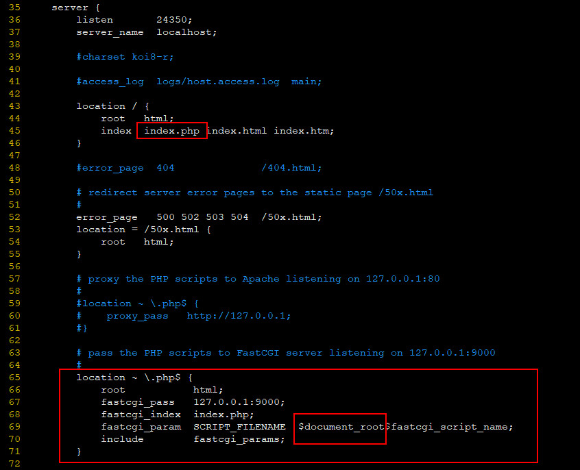
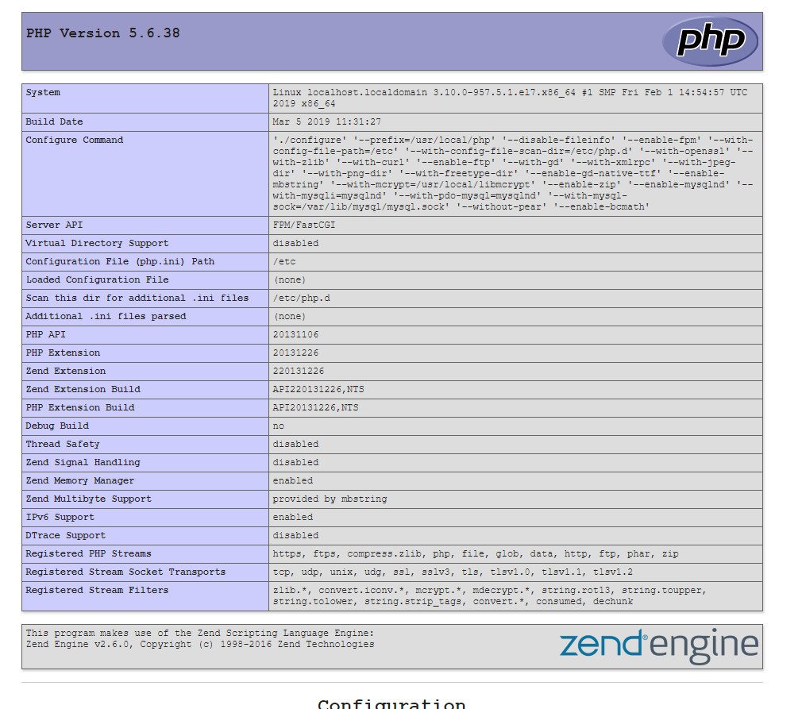

## Install php5.6 based on Nginx and CentOS7.6

### 0 SYSTEM
| Serial | Environment | Version                              |
|:------:|:-----------:|:-------------------------------------|
| 1      | ISO         | CentOS-7-x86_64-DVD-1810.iso         |
| 2      | Linux       | CentOS Linux release 7.6.1810 (Core) |
| 3      | Nginx       | 1.14.2                               |
| 4      | PHP         | 5.6.38                               |

### 1 INSTALL

#### 1.1 REMOVE LOCAL PHP
```shell
yum list installed | grep php
```
```shell
yum remove php*
```

#### 1.2 CREATE USER
```shell
groupadd www
useradd -g www -s /sbin/nologin www
```
```shell
cat /etc/group | grep www
cat /etc/passwd | grep www
```

#### 1.3 PACKAGE DEPENDENCE
1. gcc & make
```shell
yum -y install \
gcc \
gcc-c++ \
make
```

2. Libmcrypt
> 参考：《[Libmcrypt By Source.md](../09.Libmcrypt By Source.md)》。

#### 1.4 PHP INSTALL

##### 1.4.1 DOWNLOAD AND UNZIP
```shell
wget http://mirrors.sohu.com/php/php-5.6.38.tar.gz
```
```shell
tar -zxvf php-5.6.38.tar.gz && cd php-5.6.38
```

##### 1.4.2 BUILD
```shell
./configure \
--prefix=/usr/local/php \
--disable-fileinfo \
--enable-fpm \
--with-config-file-path=/usr/local/php/etc \
--with-config-file-scan-dir=/usr/local/php/etc/php.d \
--with-openssl \
--with-zlib \
--with-curl \
--enable-ftp \
--with-gd \
--with-xmlrpc \
--with-jpeg-dir \
--with-png-dir \
--with-freetype-dir \
--enable-gd-native-ttf \
--enable-mbstring \
--with-mcrypt=/usr/local/libmcrypt \
--enable-zip \
--enable-mysqlnd \
--with-mysqli=mysqlnd \
--with-pdo-mysql=mysqlnd \
--with-mysql-sock=/var/lib/mysql/mysql.sock \
--without-pear \
--enable-bcmath
```

**Note:**<br>
`--with-config-file-path`和`--with-config-file-scan-dir`这两个配置要当心，这两个字段是配置ini路径的，最好是放在与php安装目录一致的环境中。

##### 1.4.3 MAKE
```shell
make && make install
```
大概需要花20分钟左右

##### 1.4.4 RESET PERMISSIONS
```shell
chown -R www:www /usr/local/php
```

##### 1.4.5 MODIFY SYSTEM ENVIRONMENT VARIABLE
1. open .base_profile
```shell
vim ~/.bash_profile
```
2. editing
<br>在`export PATH`之前添加以下内容
```
PHP_HOME=/usr/local/php
PATH=$BASE_PATH:$HOME/bin:$MYSQL_PATH:$JAVA_PATH:$REDIS_HOME/src:$NGINX_HOME/sbin:$PHP_HOME/bin
```
3. 立即生效
```shell
source ~/.bash_profile
```

##### 1.4.6 PHP.INI
```shell
cp /root/downloads/php-5.6.38/php.ini-development /usr/local/php/etc/php.ini
```

##### 1.4.7 php-fpm
```shell
cp /usr/local/php/etc/php-fpm.conf.default /usr/local/php/etc/php-fpm.conf
```
```shell
cp /root/downloads/php-5.6.38/sapi/fpm/init.d.php-fpm /etc/init.d/php-fpm
```
```shell
chmod +x /etc/init.d/php-fpm
```
```shell
chkconfig --add php-fpm
chkconfig php-fpm on
chmod -R 755 /etc/init.d/php-fpm
```
```shell
service php-fpm start
```

#### 1.4.8 CHECK VERSION
```shell
php -v
```
```
PHP 5.6.38 (cli) (built: Mar  5 2019 11:34:08)
Copyright (c) 1997-2016 The PHP Group
Zend Engine v2.6.0, Copyright (c) 1998-2016 Zend Technologies
```

#### 1.5 CONFIGURE NGINX

##### 1.5.1 EDITING NGINX.CONF
```shell
vim /usr/local/nginx/conf/nginx.conf
```


这样配置完成之后，php的工作目录是在`/usr/local/nginx/html/`。

##### 1.5.2 RESTART NGINX
```shell
nginx -s quit
nginx
```

##### 1.5.3 test
```shell
vim /usr/local/nginx/html/php-info.php
```
```php
<?php
echo phpinfo();
```

最后访问下面的网址即可
```
http://192.168.37.152:24350/php-info.php
```

正确的情况下会出现这样的界面




### REF
- http://www.cnblogs.com/wujuntian/p/8183952.html
