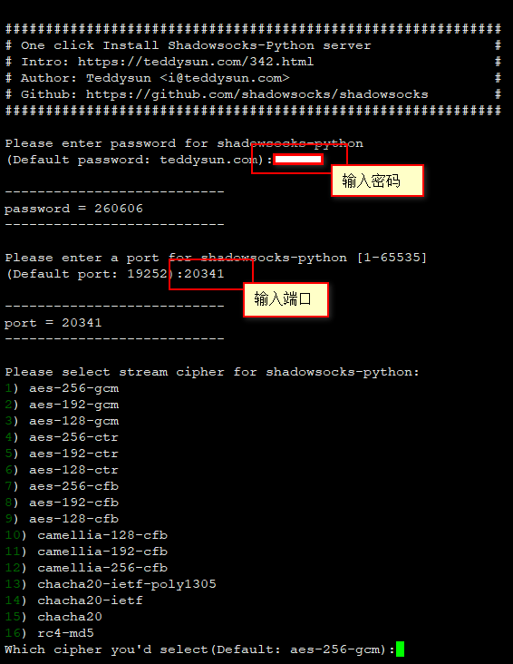
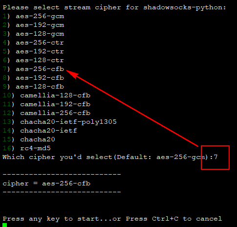
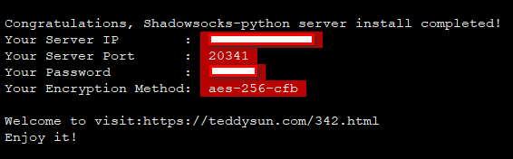

## Vultr搭建SS步骤

### 一、Vultr服务器购买

> 略

### 二、基于XShell的SS脚本安装

1.下载安装脚本

```shell
wget --no-check-certificate -O shadowsocks.sh https://raw.githubusercontent.com/teddysun/shadowsocks_install/master/shadowsocks.sh
chmod +x shadowsocks.sh
./shadowsocks.sh 2<&1 | tee shadowsocks.log
```

2.设置密码及端口



3.设置数据加密方式



4.配置完成的结果反馈



### 客户端

**Windows**

- [https://github.com/shadowsocks/shadowsocks-windows/releases](https://github.com/shadowsocks/shadowsocks-windows/releases)

**Android**

- [https://github.com/shadowsocks/shadowsocks-android/releases](https://github.com/shadowsocks/shadowsocks-android/releases)

-----

日期： 2019年06月21日

-----

- [Github](https://github.com/qwhai)
- [Blog<sup>csdn</sup>](https://qwhai.blog.csdn.net)
- [E-mail](return_zero0@163.com)
