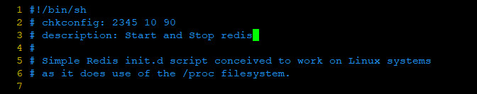
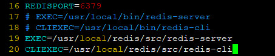

## Redis on CentOS 7.6

### 0 SYSTEM ENVIRONMENTAL
| Serial | Environment | Version                              |
|:------:|:-----------:|:-------------------------------------|
| 1      | ISO         | CentOS-7-x86_64-DVD-1810.iso         |
| 2      | Linux       | CentOS Linux release 7.6.1810 (Core) |
| 3      | Redis       | redis-5.0.3                          |

### 1 PACKAGE DEPENDENCE
> gcc

### 2 REDIS INSTALL

#### 2.1 DOWNLOAD AND UNZIP
```shell
wget http://download.redis.io/releases/redis-5.0.3.tar.gz
tar -zxvf redis-5.0.3.tar.gz && cd redis-5.0.3
```

#### 2.2 MAKE
```shell
cd ..
mv redis-5.0.3 /usr/local/redis && cd /usr/local/redis
```
```shell
make && make install
```

#### 2.4 MODIFY SYSTEM ENVIRONMENT VARIABLE
```shell
vim ~/.bash_profile
```
```
REDIS_HOME=/usr/local/redis
PATH=$BASE_PATH:$HOME/bin:$MYSQL_PATH:$JAVA_PATH:$REDIS_HOME/src
```
```shell
source ~/.bash_profile
```

#### 2.5 CONFIGURE REDIS.CONF
*COMMAND*
```shell
vim /usr/local/redis/redis.conf
```
*EDIT*<br>
1. modify `daemonize no` to `daemonize yes` for start in the background.
2. modify `# bind 127.0.0.1` to `bind 0.0.0.0` for let any IP can connect this machine.
3. modify `protected-mode yes` to `protected-mode no` that if you not need password.
4. modify `# requirepass foobared` to `requirepass [password]` that if you need password.eg: `requirepass 123456`

#### 2.6 FIREWALL
```shell
firewall-cmd --zone=public --add-port=6379/tcp --permanent
firewall-cmd --reload
firewall-cmd --zone=public --list-ports
```

#### 2.7 RUN
*2.6.1 START*
```shell
redis-server /usr/local/redis/redis.conf
```
*2.6.2 START MESSAGE*
```
13170:C 27 Feb 2019 12:59:56.494 # oO0OoO0OoO0Oo Redis is starting oO0OoO0OoO0Oo
13170:C 27 Feb 2019 12:59:56.494 # Redis version=5.0.3, bits=64, commit=00000000, modified=0, pid=13170, just started
13170:C 27 Feb 2019 12:59:56.494 # Configuration loaded
```

*2.6.3 CHECK*
```shell
netstat -nlpt
```
*2.6.4 CHECK MESSAGE*
```
tcp        0      0 0.0.0.0:6379            0.0.0.0:*               LISTEN      13171/./src/redis-s
tcp        0      0 0.0.0.0:22              0.0.0.0:*               LISTEN      7079/sshd           
tcp6       0      0 :::6379                 :::*                    LISTEN      13171/./src/redis-s
tcp6       0      0 :::22                   :::*                    LISTEN      7079/sshd           
```

*2.6.5 START REDIS-CLI*
```
[root@localhost src]# redis-cli
127.0.0.1:6379> auth 123456
OK
127.0.0.1:6379> set test1 0001
OK
127.0.0.1:6379> get test1
"0001"
```

#### 2.7 STOP
```shell
ps -ef | grep redis
```
```shell
kill -9 [pid]
```

### 3 START WITH SYSTEM
#### 3.1 MKDIR AND COPY REDIS.CONF
```shell
mkdir /etc/redis
cp /usr/local/redis/redis.conf /etc/redis/6379.conf
```

#### 3.2 COPY INIT SCRIPT
```shell
cp /usr/local/redis/utils/redis_init_script /etc/init.d/redis
```

#### 3.3 MODIFY INIT SCRIPT
```shell
vim /etc/init.d/redis
```
edit two lines like this
```
# chkconfig: 2345 10 90
# description: Start and Stop redis
```


reset `EXEC` and `CLIEXEC`



#### 3.4 START
```shell
service redis start # start redis command
service redis stop  # stop redis command
```
you need reboot sometimes.
```shell
chkconfig redis on  # start with system
chkconfig redis off
```

### Ref
- https://blog.csdn.net/linyifan_/article/details/86508298
- https://www.cnblogs.com/skyessay/p/6433349.html
