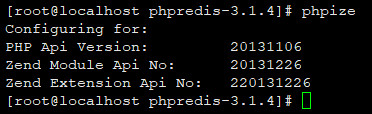
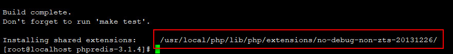
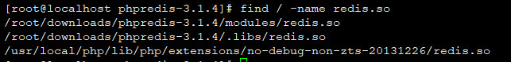
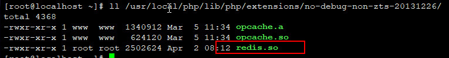
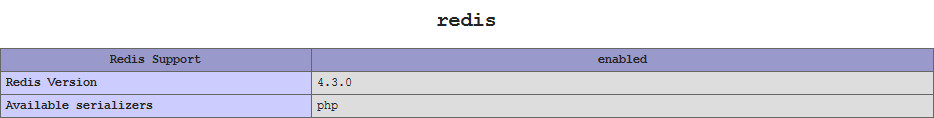

## CentOS7安装php-redis扩展

### 0.SYSTEM

| Serial | Environment | Version                              |
|:------:|:-----------:|:-------------------------------------|
| 1      | ISO         | CentOS-7-x86_64-DVD-1810.iso         |
| 2      | Linux       | CentOS Linux release 7.6.1810 (Core) |
| 3      | Nginx       | 1.14.2                               |
| 4      | PHP         | 5.6.38                               |
| 5      | Redis       | redis-5.0.3                          |
| 6      | php-redis   | 4.3.0                                |

### 1.INSTALL

#### 1.1.downloads & unzip

```shell
cd ~/downloads
wget https://github.com/phpredis/phpredis/archive/4.3.0.tar.gz
tar -zxvf 4.3.0.tar.gz;cd phpredis-4.3.0
```

#### 1.2.check php
```shell
phpize
```



#### 1.3.install
```shell
./configure \
--with-php-config=/usr/local/php/bin/php-config
```
```shell
make && make install
```



在结尾部分可以看到extension的路径是`/usr/local/php/lib/php/extensions/no-debug-non-zts-20131226/`

#### 1.4.check redis.so
```shell
find / -name redis.so
```


```shell
ll /usr/local/php/lib/php/extensions/no-debug-non-zts-20131226/
```


#### 1.5.config redis.so
```shell
vim /usr/local/php/etc/php.ini
```
```
extension_dir="/usr/local/php/lib/php/extensions/no-debug-non-zts-20131226/"
extension=redis.so
```

#### 1.6.restart
1. restart php-fpm
```shell
service php-fpm restart
```

2. restart nginx
```shell
ps -ef | grep nginx
kill -9 [pid]
```



### Ref
- https://www.cnblogs.com/kevinggk/p/6914804.html
- https://blog.csdn.net/zyddj123/article/details/82698428
- [修复php.ini未生效记录](02.修复php.ini未生效记录.md)
