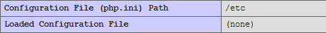
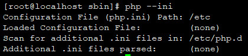

## 修复php.ini未生效记录

### 背景说明
我想安装phpredis的扩展，结果发现怎么安装都安装不上。

查看phpinfo时发现



使用`php --ini`命令查找如下结果：



这边暂时未能找到如何在Nginx环境下解决修改php.ini路径的办法，只能重新安装，在安装时指定。

我目前的处理办法是，将`/usr/local/php/etc/php.ini`复制到`/etc`目录下。
再重启Nginx和php-pfm.

```shell
ps -ef | grep nginx
kill -9 [pid]
```
```shell
service php-fpm restart
```

### 补充
上面是的Linux环境下，这里补充一个在Windows+Apache环境下的。

环境`Win10`
修改完`memory_limit`配置后，重启Apache没有立即生效。
出现此问题的情况可能有很多，比如多版本PHP、未重启Apache等。但是，我并非是因为这些问题导致的。
当我检查 phpinfo() 后，发现`Loaded Configuration File`配置项的值为none。

于是修改Apache中的httpd.conf文件，添加一行
```
PHPINIDir "F:/PHP/php-5.6.37"
```

### Ref
- [https://blog.csdn.net/wt1286331074/article/details/87619796](https://blog.csdn.net/wt1286331074/article/details/87619796)
- [https://www.v2ex.com/t/268735](https://www.v2ex.com/t/268735)
- [https://bbs.csdn.net/topics/120081949](https://bbs.csdn.net/topics/120081949)
