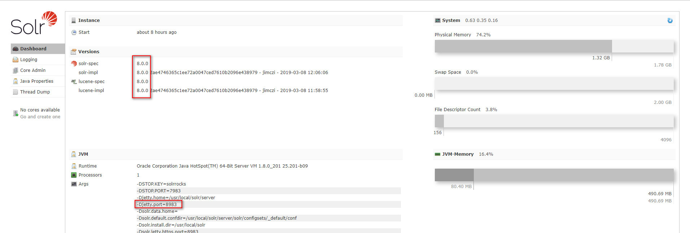

## Solr8 on centos7

### 系统环境

| Serial | Environment | Version                              |
|:------:|:-----------:|:-------------------------------------|
| 1      | ISO         | CentOS-7-x86_64-DVD-1810.iso         |
| 2      | Linux       | CentOS Linux release 7.6.1810 (Core) |
| 3      | Java        | 1.8.0_201                            |
| 4      | lsof        | lsof 4.87                            |
| 5      | Solr        | 8.0.0                                |
| 6      | ip          | 192.168.37.152                       |

### 安装

**1.依赖包安装**

```shell
yum install lsof -y
```

**2.数据包下载**
```shell
wget https://mirrors.tuna.tsinghua.edu.cn/apache/lucene/solr/8.0.0/solr-8.0.0.tgz
```

**3.解压及数据包迁移**
```shell
tar -zxvf solr-8.0.0.tgz;mv solr-8.0.0 /usr/local/solr
```

**4.启动**
```shell
# 启动solr
/usr/local/solr/bin/solr start
# 停止solr
/usr/local/solr/bin/solr stop
# 重启solr
/usr/local/solr/bin/solr restart -force
```
这里运行`start`命令时，出现如下报错信息
```
*** [WARN] *** Your open file limit is currently 1024.  
 It should be set to 65000 to avoid operational disruption.
 If you no longer wish to see this warning, set SOLR_ULIMIT_CHECKS to false in your profile or solr.in.sh
*** [WARN] ***  Your Max Processes Limit is currently 7184.
 It should be set to 65000 to avoid operational disruption.
 If you no longer wish to see this warning, set SOLR_ULIMIT_CHECKS to false in your profile or solr.in.sh
WARNING: Starting Solr as the root user is a security risk and not considered best practice. Exiting.
         Please consult the Reference Guide. To override this check, start with argument '-force'
```
这里一共出现了三处`WARNING`，前两处`WARNING`报错的原因是CentOS对打开文件的数量和进程数有限制，可以通过设置忽略报错解决（另外，也可以通过设置系统的限制来解决）如下：
```shell
vim /usr/local/solr/bin/solr.in.sh
```
```shell
# Different limits can be set in solr.in.sh or your profile if you prefer as well.
#SOLR_RECOMMENDED_OPEN_FILES=
#SOLR_RECOMMENDED_MAX_PROCESSES=
SOLR_ULIMIT_CHECKS=false
```
第3处`WARNING`是提示需要在命令中添加`-force`参数。
```shell
# 启动solr
/usr/local/solr/bin/solr start -force
# 停止solr
/usr/local/solr/bin/solr stop
# 重启solr
/usr/local/solr/bin/solr restart -force
```

**5.防火墙**
> 这里开放`8983`端口

```shell
firewall-cmd --zone=public --add-port=8983/tcp --permanent
firewall-cmd --reload
firewall-cmd --zone=public --list-ports
```

**6.配置环境变量**
> 配置系统环境变量

```shell
vim ~/.bash_profile
```
```
SOLR_PATH=/usr/local/solr
PATH=$PATH:$HOME/bin:$SOLR_PATH/bin
```
```shell
source ~/.bash_profile
```

**7.检查**

在浏览器中访问如下网址（默认端口：8983）：
```
http://192.168.37.152:8983/solr/#/
```
当正确安装solr后，会出现如下页面：


