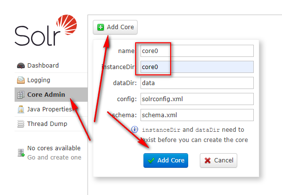
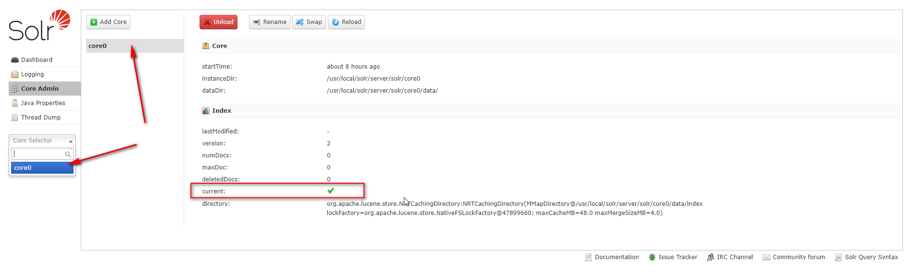
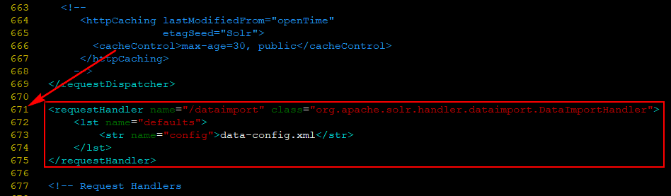
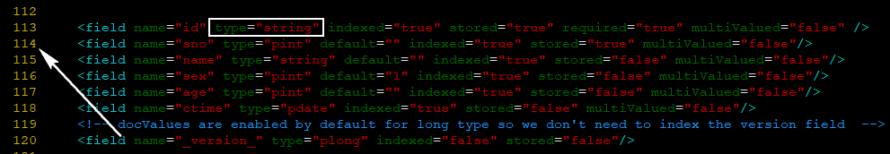
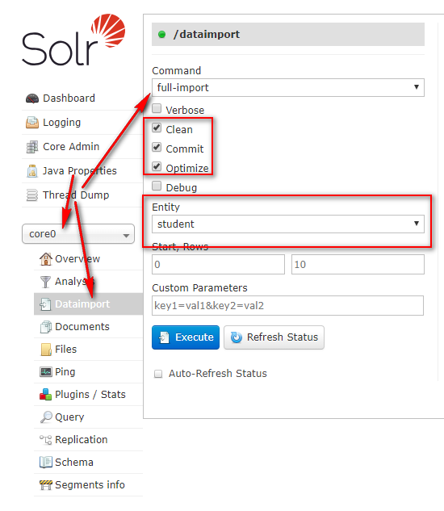
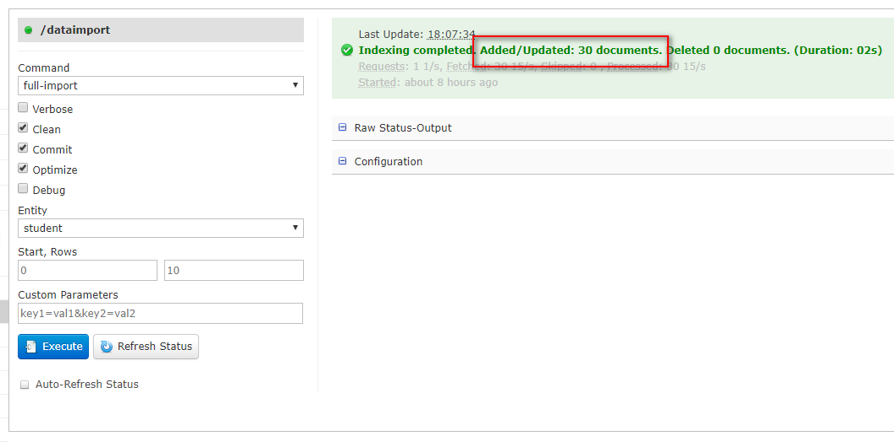
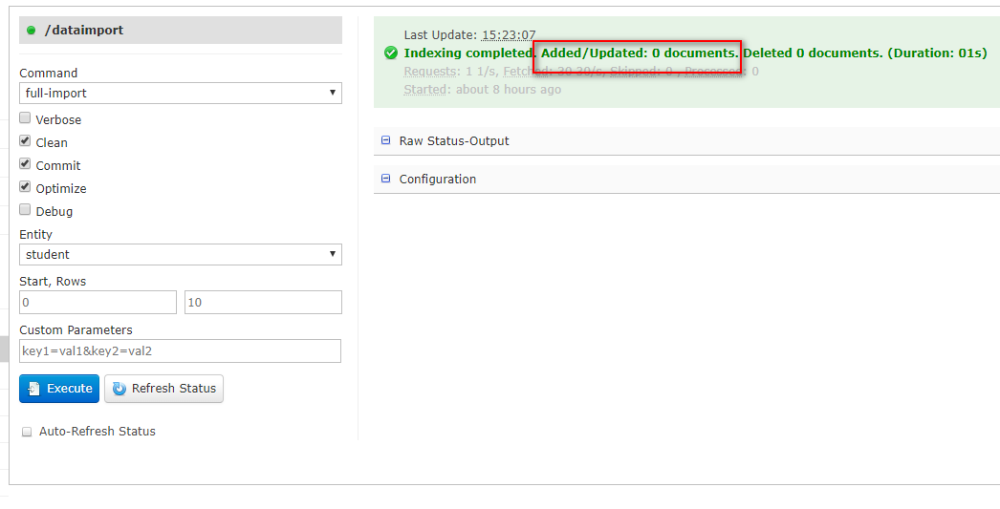
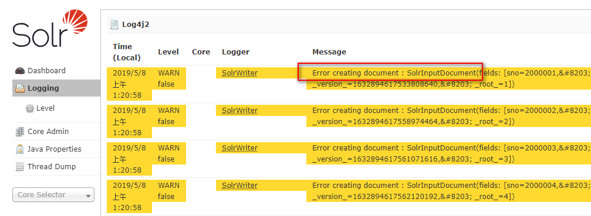
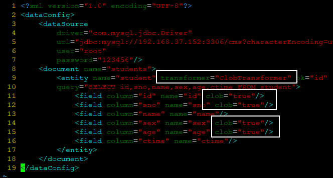
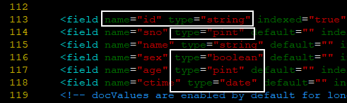

## Solr8.0链接MySQL并导入数据

### 系统环境

| Serial | Environment     | Version                              |
|:------:|:---------------:|:-------------------------------------|
| 1      | ISO             | CentOS-7-x86_64-DVD-1810.iso         |
| 2      | Linux           | CentOS Linux release 7.6.1810 (Core) |
| 3      | Java            | 1.8.0_201                            |
| 4      | lsof            | lsof 4.87                            |
| 5      | Solr            | 8.0.0                                |
| 6      | ip              | 192.168.37.152                       |
| 7      | mysql-connector | 5.1.34                               |

### 构建

#### 1.mysql驱动包
1)下载`mysql-connector-java-5.1.34.jar`
```shell
wget http://central.maven.org/maven2/mysql/mysql-connector-java/5.1.34/mysql-connector-java-5.1.34.jar
```
2)拷贝到`/usr/local/solr/server/solr-webapp/webapp/WEB-INF/lib/`目录
```shell
cp ~/downloads/mysql-connector-java-5.1.34.jar /usr/local/solr/server/solr-webapp/webapp/WEB-INF/lib/
```

#### 2.创建Solr的核心：`core0`

1.拷贝本地配置

```shell
mkdir /usr/local/solr/server/solr/core0
```
```shell
cp -a /usr/local/solr/server/solr/configsets/_default/* /usr/local/solr/server/solr/core0/
```

2.网页端配置



点击[Add Core]后，出现如下页面表示创建成功



#### 3.solr-dataimporthandler-8.0.0.jar

拷贝`solr-dataimporthandler-8.0.0.jar`到相应web目录下

```shell
cp -a /usr/local/solr/dist/solr-dataimporthandler-8.0.0.jar /usr/local/solr/server/solr-webapp/webapp/WEB-INF/lib/
cp -a /usr/local/solr/dist/solr-dataimporthandler-extras-8.0.0.jar /usr/local/solr/server/solr-webapp/webapp/WEB-INF/lib/
```

#### 4.xml配置

1. solrconfig.xml
```shell
vim /usr/local/solr/server/solr/core0/conf/solrconfig.xml
```
添加如下信息
```xml
<requestHandler name="/dataimport" class="org.apache.solr.handler.dataimport.DataImportHandler">
    <lst name="defaults">
        <str name="config">data-config.xml</str>
    </lst>
</requestHandler>
```


2. data-config.xml
```shell
vim /usr/local/solr/server/solr/core0/conf/data-config.xml
```
```xml
<?xml version="1.0" encoding="UTF-8"?>
<dataConfig>
    <!-- 数据库信息 -->
    <dataSource
        driver="com.mysql.jdbc.Driver"
        url="jdbc:mysql://192.168.37.152:3306/cms?characterEncoding=utf8&amp;useSSL=true&amp;serverTimezone=UTC"
        user="root"
        password="123456"/>
    <document name="students">
        <!-- document实体 -->
        <!--
        query: 全量导入数据配置
        deltaImportQuery: 增量导入数据配置
        -->
        <entity name="student" transformer="ClobTransformer" pk="id"
        query="SELECT id,sno,name,sex,age,ctime FROM student"
        deltaImportQuery="SELECT id,sno,name,sex,age,ctime FROM cms.student where id ='${dataimporter.delta.id}'"
        deltaQuery="SELECT id FROM student where ctime > '${dataimporter.last_index_time}'">
            <!--数据库字段映射solr字段-->
            <field column="id" name="id" clob="true"/>
            <field column="sno" name="sno" clob="true"/>
            <field column="name" name="name"/>
            <field column="sex" name="sex" clob="true"/>
            <field column="age" name="age" clob="true"/>
            <field column="ctime" name="ctime"/>
        </entity>
    </document>
</dataConfig>
```

注意：这里要使用`&amp;`代替`&`符号，不然数据库连接会失败。

- entity: 对应数据库的数据表
- field: 应对数据表中的字段
- name: 表名
- pk: 主键名
- query: 查询SQL语句


3. managed-schema<br>
在当managed-schema文件中加入相应的类型映射
```shell
vim /usr/local/solr/server/solr/core0/conf/managed-schema
```
```xml
<field name="id" type="pint" indexed="true" stored="true" required="true" multiValued="false"/>
<field name="sno" type="pint" default="" indexed="true" stored="true" multiValued="false"/>
<field name="name" type="string" default="" indexed="true" stored="false" multiValued="false"/>
<field name="sex" type="boolean" default="1" indexed="true" stored="false" multiValued="false"/>
<field name="age" type="pint" default="" indexed="true" stored="false" multiValued="false"/>
<field name="ctime" type="pdate" indexed="true" stored="false" multiValued="false"/>
```
注意：这里的类型`type`中不可使用`int`，要使用`pint`；`date`类型同样使用`pdate`来代替。


#### 5.重启Solr
```shell
solr restart -force
```

#### 6.数据导入
配置完成之后，在网页端点击`[Core Selector]`下拉框，选中`core0`选项，出现如下操作面板，选择[Dataimport]选项进行数据导入设置。



在这一步中点击`[Execute]`按钮即可完成导入。


如图，说明此时已经导入了30条document数据。

### 异常情况处理

> 1. 数据导入未成功

#### 1.数据导入未成功

在如上操作的数据导入时，出现操作完成，但没有导入数据的情况，如下图所示：



通过检查日志（Logging）：



可以发现数据未导入成功的原因是`field`的类型与MySQL中查找到的数据类型不匹配导致的。本文所使用的数据表中有5种类型的数据：
- int
- string
- tinyint
- smallint
- datetime

其中`int/tinyint/smallint/datetime`并非是默认支持的类型，需要在`entity`中添加`transformer="ClobTransformer"`来指定转换器，并在`field`中显式指明`clob="true"`。

*data-config.xml*



而在处理字段映射时，需要分别指定这些类型为：`pint/boolean/pint/date`。

*managed-schema*



```xml
<fieldType name="date" class="solr.TrieDateField" docValues="true" precisionStep="0" positionIncrementGap="0"/>
<fieldType name="pdate" class="solr.DatePointField" docValues="true"/>
<fieldType name="rdate" class="solr.DateRangeField" docValues="false"/>
```

### 附录
> 在构建过程中的第4步(xml配置)中，对`xml`的配置都与实际数据相关，这里给出相关数据模型。

```sql
DESC cms.student;
```
```
+-------+-----------------+------+-----+---------+----------------+
| Field | Type            | Null | Key | Default | Extra          |
+-------+-----------------+------+-----+---------+----------------+
| id    | int(11)         | NO   | PRI | NULL    | auto_increment |
| sno   | int(7) unsigned | NO   |     | NULL    |                |
| name  | varchar(20)     | NO   |     | NULL    |                |
| sex   | tinyint(1)      | NO   |     | NULL    |                |
| age   | smallint(6)     | NO   |     | NULL    |                |
| ctime | datetime        | NO   |     | NULL    |                |
+-------+-----------------+------+-----+---------+----------------+
```
```sql
SELECT * FROM cms.student;
```
```
+----+---------+-------------+-----+-----+---------------------+
| id | sno     | name        | sex | age | ctime               |
+----+---------+-------------+-----+-----+---------------------+
|  1 | 2000001 | Aiden       |   1 |  20 | 2018-07-23 21:42:49 |
|  2 | 2000002 | Jackson     |   1 |  17 | 2018-09-29 12:51:53 |
|  3 | 2000003 | Samuel      |   1 |  18 | 2018-08-12 02:02:10 |
|  4 | 2000004 | Owen        |   0 |  17 | 2018-08-15 15:03:37 |
|  5 | 2000005 | Jonathan    |   1 |  20 | 2018-08-17 20:29:14 |
|  6 | 2000006 | Michael     |   1 |  17 | 2018-08-17 15:35:06 |
|  7 | 2000007 | Paddy       |   0 |  19 | 2018-09-04 12:45:33 |
|  8 | 2000008 | Evan        |   0 |  18 | 2018-09-18 17:56:39 |
|  9 | 2000009 | Thomas      |   0 |  19 | 2018-09-12 21:21:37 |
| 10 | 2000010 | Christopher |   0 |  20 | 2018-08-07 22:33:50 |
| 11 | 2000011 | Rock        |   1 |  17 | 2018-08-19 22:41:34 |
| 12 | 2000012 | James       |   0 |  20 | 2018-08-29 23:11:07 |
| 13 | 2000013 | Anthony     |   1 |  18 | 2018-09-30 22:46:08 |
| 14 | 2000014 | Ethan       |   1 |  20 | 2018-07-24 23:39:31 |
| 15 | 2000015 | Andrew      |   0 |  17 | 2018-09-01 20:40:22 |
| 16 | 2000016 | Brandon     |   1 |  20 | 2018-09-18 12:07:05 |
| 17 | 2000017 | Lucas       |   0 |  19 | 2018-07-14 02:52:14 |
| 18 | 2000018 | Daniel      |   0 |  19 | 2018-07-08 19:20:59 |
| 19 | 2000019 | William     |   0 |  17 | 2018-09-01 18:33:39 |
| 20 | 2000020 | Liam        |   1 |  19 | 2018-07-12 19:56:51 |
| 21 | 2000021 | Noah        |   1 |  20 | 2018-09-30 23:32:16 |
| 22 | 2000022 | Elijah      |   0 |  17 | 2018-07-11 14:21:57 |
| 23 | 2000023 | Ryan        |   0 |  18 | 2018-07-19 18:34:29 |
| 24 | 2000024 | Mason       |   1 |  17 | 2018-09-30 00:15:04 |
| 25 | 2000025 | Ronald      |   1 |  18 | 2018-08-28 11:55:07 |
| 26 | 2000026 | Gavin       |   0 |  20 | 2018-07-19 04:24:52 |
| 27 | 2000027 | David       |   1 |  18 | 2018-07-03 05:45:01 |
| 28 | 2000028 | Matthew     |   1 |  18 | 2018-07-06 04:30:29 |
| 29 | 2000029 | Gabriel     |   1 |  18 | 2018-07-28 12:10:25 |
| 30 | 2000030 | Jacob       |   1 |  19 | 2018-08-25 22:31:08 |
+----+---------+-------------+-----+-----+---------------------+
```
