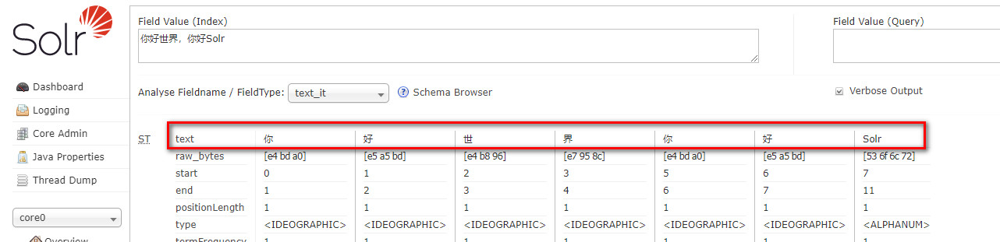
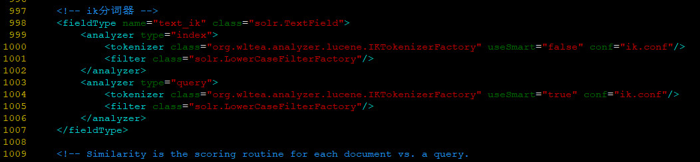

## Solr配置中文分词

如果Solr中未配置中文分词时，分析中文的是这样子的



### 系统环境

| Serial | Environment     | Version                              |
|:------:|:---------------:|:-------------------------------------|
| 1      | ISO             | CentOS-7-x86_64-DVD-1810.iso         |
| 2      | Linux           | CentOS Linux release 7.6.1810 (Core) |
| 3      | Java            | 1.8.0_201                            |
| 4      | lsof            | lsof 4.87                            |
| 5      | Solr            | 8.0.0                                |
| 6      | ik-analyzer     | 7.7.0                                |

### 中文分词库`ik-analyzer`的安装

1.下载上述`IK-analyzer.rar`数据包
> 下载地址：http://39.104.164.240:9001/Linux/Solr/IK-analyzer.rar

2.解压
> 解压`IK-analyzer.rar`数据包，并将`resources`目录打包成`resources.tar.gz`压缩包。这里这样做的目的在于当前CentOS系统中不可直接解压rar文件。这里是为了避免安装rar工具包。

3.`rz`上传到`downloads`目录
> 略

4.ik-analyzer-7.7.0.jar
```shell
cp ik-analyzer-7.7.0.jar /usr/local/solr/server/solr-webapp/webapp/WEB-INF/lib/
```

5.解压`resources`
```shell
tar -zxvf resources.tar.gz
```

6.拷贝字典库

```shell
mkdir /usr/local/solr/server/solr-webapp/webapp/WEB-INF/classes/
```
```shell
cp resources/IKAnalyzer.cfg.xml /usr/local/solr/server/solr-webapp/webapp/WEB-INF/classes/
cp resources/ext.dic /usr/local/solr/server/solr-webapp/webapp/WEB-INF/classes/
cp resources/stopword.dic /usr/local/solr/server/solr-webapp/webapp/WEB-INF/classes/
cp resources/ik.conf /usr/local/solr/server/solr-webapp/webapp/WEB-INF/classes/
cp resources/dynamicdic.txt /usr/local/solr/server/solr-webapp/webapp/WEB-INF/classes/
```

7.配置Solr的managed-schema，添加ik分词器
```shell
vim /usr/local/solr/server/solr/core0/conf/managed-schema
```
```xml
<!-- ik分词器 -->
<fieldType name="text_ik" class="solr.TextField">
    <analyzer type="index">
        <tokenizer class="org.wltea.analyzer.lucene.IKTokenizerFactory" useSmart="false" conf="ik.conf"/>
        <filter class="solr.LowerCaseFilterFactory"/>
    </analyzer>
    <analyzer type="query">
        <tokenizer class="org.wltea.analyzer.lucene.IKTokenizerFactory" useSmart="true" conf="ik.conf"/>
        <filter class="solr.LowerCaseFilterFactory"/>
    </analyzer>
</fieldType>
```


8.重启Solr服务,测试分词

> 这里需要在`Fieldname/FieldType`中选中`text_ik`选项。


9.ik.conf文件说明
```conf
Wed Aug 01 11:21:30 CST 2018
files=dynamicdic.txt
lastupdate=0
```

- files
<br>动态词典列表，可以设置多个词典表，用逗号进行分隔。默认动态词典表为dynamicdic.txt
- lastupdate
<br>默认值为0，每次对动态词典表修改后需要手动+1，以防新添加的词语未被添加到内存中

### Ref
- https://www.cnblogs.com/caleyun/articles/10455985.html
