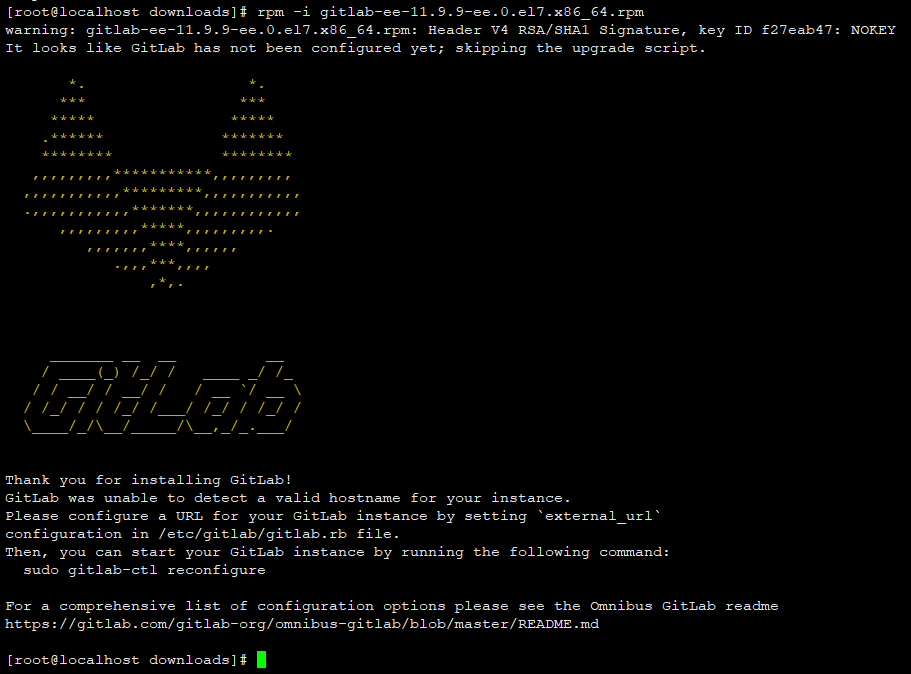
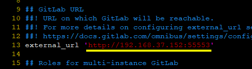
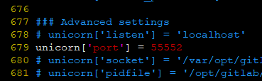
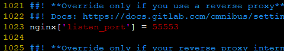
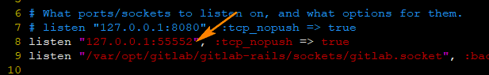
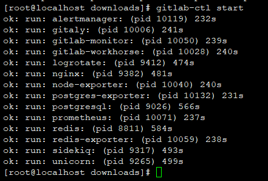
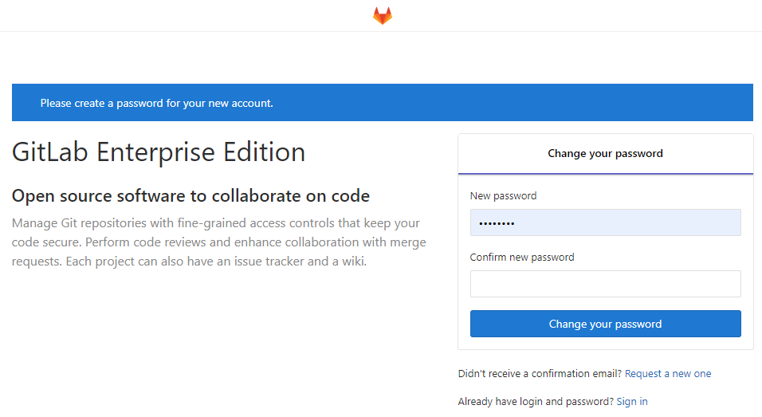

## Gitlab on centos7

### 系统环境

| Serial | Environment | Version                              |
|:------:|:-----------:|:-------------------------------------|
| 1      | ISO         | CentOS-7-x86_64-DVD-1810.iso         |
| 2      | Linux       | CentOS Linux release 7.6.1810 (Core) |
| 3      | Nginx       | 1.14.2                               |
| 4      | Gitlab      | GitLab Enterprise Edition 11.9.9     |
| 5      | ip          | 192.168.37.152                       |

### 安装

#### 安装依赖项
```shell
yum -y install \
policycoreutils policycoreutils-python \
openssh-server openssh-clients \
postfix
```

#### 安装Gitlab

1. 下载
```shell
wget https://mirrors.tuna.tsinghua.edu.cn/gitlab-ee/yum/el7/gitlab-ee-11.9.9-ee.0.el7.x86_64.rpm
```

2. 安装
```shell
rpm -i gitlab-ee-11.9.9-ee.0.el7.x86_64.rpm
```


3. 重新加载配置文件
```shell
gitlab-ctl reconfigure
```
这一步比较耗时。

4. 备份主配置`gitlab.rb`
```shell
cp /etc/gitlab/gitlab.rb /etc/gitlab/gitlab.rb.bak
```

5. 配置gitlab host
```shell
vim /etc/gitlab/gitlab.rb
```

<br>这里注意需要使用实际的ip地址，不要使用*127.0.0.1*，这里的ip地址会被用于项目`clone`。比如：`git\@192.168.37.152:test1/project1.git`。

6. 修改默认端口
```shell
vim /etc/gitlab/gitlab.rb
```
<br><br>


7. 重新加载配置文件
```shell
gitlab-ctl reconfigure
```

8. 修改默认仓储位置
<br>安装完成后，默认仓储的位置在`/var/opt/gitlab/git-data`。
<br>修改操作待续...

9. 修改gitlab端口
```shell
cp /var/opt/gitlab/gitlab-rails/etc/unicorn.rb /var/opt/gitlab/gitlab-rails/etc/unicorn.rb.bak
```
```shell
vim /var/opt/gitlab/gitlab-rails/etc/unicorn.rb
```


10. 修改web访问端口
```shell
cp /var/opt/gitlab/nginx/conf/gitlab-http.conf /var/opt/gitlab/nginx/conf/gitlab-http.conf.bak
```
```shell
vim /var/opt/gitlab/nginx/conf/gitlab-http.conf
```


11. 配置防火墙
```shell
firewall-cmd --zone=public --add-port=55552/tcp --permanent
firewall-cmd --zone=public --add-port=55553/tcp --permanent
firewall-cmd --reload
firewall-cmd --zone=public --list-ports
```

12. 重新加载配置文件
```shell
gitlab-ctl reconfigure
```

13. 启动
```shell
gitlab-ctl start
```


### 访问GitLab

访问链接：```http://192.168.37.152:55553```



此界面表示配置`root`的初始密码。

### Ref
- https://mirrors.tuna.tsinghua.edu.cn/gitlab-ce/yum/el7/
- https://mirrors.tuna.tsinghua.edu.cn/gitlab-ee/yum/el7/

----------------

- [E-mail](return_zero0@163.com)
