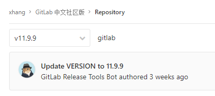
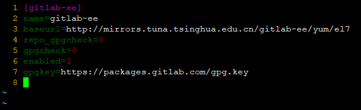

## Gitlab汉化流程

> 未完待续

### 系统环境

| Serial | Environment | Version                              |
|:------:|:-----------:|:-------------------------------------|
| 1      | Linux       | CentOS Linux release 7.6.1810 (Core) |
| 2      | Gitlab      | GitLab Enterprise Edition 11.9.9     |

### 汉化包

GitLab的汉化需要根据自己的`GitLab`版本选择汉化包。汉化包地址：[https://gitlab.com/xhang/gitlab](https://gitlab.com/xhang/gitlab)
<br>这里我选的是：<br>


### 汉化步骤
1.确认版本

```shell
cat /opt/gitlab/embedded/service/gitlab-rails/VERSION
```
```
11.9.9-ee
```

```shell
vim /etc/yum.repos.d/gitlab-ee.repo
```


备份原版：
```shell
cp -r /opt/gitlab/embedded/service/gitlab-rails{,.ori}
```

覆盖
```shell
/bin/cp -rf ./gitlab-v11.9.9/* /opt/gitlab/embedded/service/gitlab-rails/
```
出现此报错信息
```
/bin/cp: cannot overwrite non-directory ‘/opt/gitlab/embedded/service/gitlab-rails/log’ with directory ‘./log’
/bin/cp: cannot overwrite non-directory ‘/opt/gitlab/embedded/service/gitlab-rails/tmp’ with directory ‘./tmp’
```
这个问题不大，可以继续。


重新配置gitlab

```shell
gitlab-ctl reconfigure
```

重启启动gitlab

```shell
gitlab-ctl restart
```
